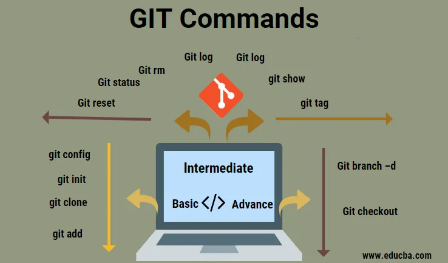

# **Git** 

## Cuprins
[1. Notiuni de baza GIT si Github](#1-notiuni-de-baza-git-si-github)\
[2. Git command line](#2-git-command-line)\
[3. Link-uri](#3-link-uri)

# 1. Notiuni de baza GIT si Github
Git este un VCS creat în 2005 de Linus Torvalds. Dezvoltatorul care a pornit kernel-ul Linux. Poate fi utilizat cu sau fără o conexiune la rețea.

* `VCS`- __*vision control system*__ este un sistem de control al versiunilor care ține evidența modificărilor pe care le facem fișierelor noastre. Prin utilizarea unui VCS, putem ști când au fost făcute modificările și cine le-a făcut.
* `Git`- este un sistem de control al versiunii cu sursă deschisă, lansat de Linus Trovalds - aceeași persoană care a creat Linux, conceput pentru a gestiona de la proiecte mici la proiecte foarte mari, cu viteză și eficiență. Este un software care te ajuta la versionarea codului personal.\
Deci, Git este un instrument de linie de comandă, dar centrul în jurul căruia toate lucrurile care implică Git se învârtesc, este GitHub.com - unde dezvoltatorii își păstrează proiectele și se conectează cu oameni asemănători.
* `branch main` = repo local (repertoriu) -este o locație în care sunt stocate toate fișierele pentru un anumit proiect. Fiecare proiect are un repo propriu și îl putem accesa printr-un URL unic.
* `origin/main branch` = repo din GitHub
* "Github.com" => server
* `Git` => program
    * _De ce este util un sistem de control al versiunilor, chiar dacă este folosit doar de o singură persoană?_\
`Raspuns`: Pentru a vedea istoricul modificărilor care ne ajută să înțelegem ce s-a schimbat și de ce si sa urmărim modificările ce permit reveniri ușoare atunci când este detectată o problemă.

    * _Ce este ***working tree***, **staging area** si ***git directory***?_\
`Raspuns` : _working tree_ conține versiunile curente ale fișierelor, _staging area(index)_ - dupa folosire git add - zona intermediară, cunoscută și sub numele de index, este un fișier întreținut de Git care conține toate informațiile despre ce fișiere care vor fi comise, iar _Directorul git_ conține toate modificările și istoricul acestora. 

PS: Orice proiect Git va consta din trei secțiuni. Directorul Git, arborele de lucru și zona de intermediara. Fiecare fișier poate fi într-una din cele trei stări principale: modificat, organizat sau angajat/comis.
* `workflow` - Aducem modificări fișierelor noastre, le organizăm cu git add și le angajăm cu git commit.

# 2. Git command line

* `git config` - setarea numele autorului și adresa de e-mail.\
Usage: git config –global user.name “[name]”  
Usage: git config –global user.email “[email address]”
Usage: git init [repository name]
* `git clone` - această comandă este utilizată pentru a clona sau copia un depozit dintr-o adresă URL folosind tastele {shift+insert} (copy-paste) link proiect\
Usage: git clone [url]
* `git pull` - sincronizare de pe server catre local
* `git fetch` - informare cu modificarile de pe server  
* `git diff` - vizualizeaza diferentele intre fisiere\
Usage: git diff + denumire fisier neincarcate pe server inca
* `git init` - creează un nou depozit Git. Poate fi folosit pentru a converti un proiect existent, fără versiuni, într-un depozit Git sau pentru a inițializa un depozit nou, gol. Majoritatea celorlalte comenzi Git nu sunt disponibile în afara unui depozit inițializat, deci aceasta este de obicei prima comandă pe care o veți rula într-un proiect nou.
* `git config -l` - configurarea curenta
* `git add` - pregatire incarcare fisier in REPO Local\
Usage: git add + denumire fisier sau mai multe separate prin spatiu liber.
    * Când apelăm Git add, îi spunem lui Git că dorim să adăugăm modificările actuale din acel fișier la lista modificărilor care urmează să fie angajate. Acest lucru înseamnă că fișierul nostru face parte, în prezent, din zona intermediară și va fi validat odată ce vom rula următoarea comandă - git commit. În acest caz, în loc să deschidem un editor, să trecem mesajul de validare folosim liniuță m, afirmând că am adăugat puncte la sfârșitul frazelor.
* `git commit` - incarcare REPO Local urmat de un comentariu\
**Usage: git commit -m “comentariu max 72 caractere in ghilimele”**
* `git commit -a` - incarcare toate fisiere fara comanda **add**
Atunci când comiteți fișiere noi sau modificări cu git commit, utilizatorul nu furnizeazea un mesaj de confirmare, angajarea/comiterea va fi întrerupt.
* `git status` - listează toate fișierele care trebuie incarcate pe serverul Github
* `git push` - incarcare finala REPO Local pe server Github
* `git checkout` - a sterge modificarile locale
* `git log` - istoricul actiunilor de comitere fisiere+comentariile folosite
    * `git log -p` -Afișează liniile adăugate cu plusuri și cele eliminate, cu liniuțe.
    * `ghit show`+ serie commit 
* `git rm`+ file = stergere din local 
* `git mv` = mutare sau redenumire 
* `git branch` -afișarea ramurilor existente
* `git merge` - combina ramurile/branch și istoricul ei Git
* `diff` - identifica diferentele dintre fisiere, împarte modificările în două secțiuni separate.
* `diff -u` este folosit pentru a compara două fișiere, linie cu linie, și pentru a avea liniile diferite comparate unul lângă altul în aceeași ieșire.
* `diff-u old_file new_ file > change.diff` => include toate modificările dintre fișierul vechi și cel nou, plus contextul suplimentar necesar pentru a înțelege modificările și pentru a aplica aceste modificări înapoi la fișierul original.
* `patch` - Aplică modificările conținute într-un fișier diff unui alt fișier.
* `patch_usage.py < disk_usage.diff` - Am pregătit un fișier diff cu modificările care trebuie aplicate scriptului
  
  
# 3. GitHub
GitHub este un serviciu de găzduire a depozitului Git bazat pe web. În plus față de funcționalitatea de control a versiunilor Git, GitHub include funcții suplimentare, cum ar fi urmărirea erorilor și gestionarea sarcinilor. GitHub ne permite să partajăm și să accesăm depozite pe web și să le copiem sau să le clonăm pe computerul nostru local, astfel încât să putem lucra la ele. Alte servicii care oferă funcționalități similare sunt BitBucket și GitLab.

Git acceptă o varietate de moduri de conectare la un depozit la distanță. Unele dintre cele mai frecvente folosesc protocoalele HTTP, HTTPS și SSH și adresele URL corespunzătoare: 
- `HTTP` este în general utilizat pentru a permite accesul numai la citire la un depozit. Cu alte cuvinte, le permite oamenilor să cloneze conținutul repo-ului dvs. fără să le permită să împingă conținut nou către acesta. 
- `HTTPS` și `SSH`, ambele oferă metode de autentificare a utilizatorilor, astfel încât să puteți controla cine primește permisiunea de a efectua actiunea de **push**.

* Se creaza cont pe GitHub si initiaza un nou repositoriu
* `git clone [link]` de la repositoriu
* `git config - - global credential.helper cache` - pentru a nu mai introduce login si parola Github.

# 4. Link-uri
* Github : https://github.com
  
