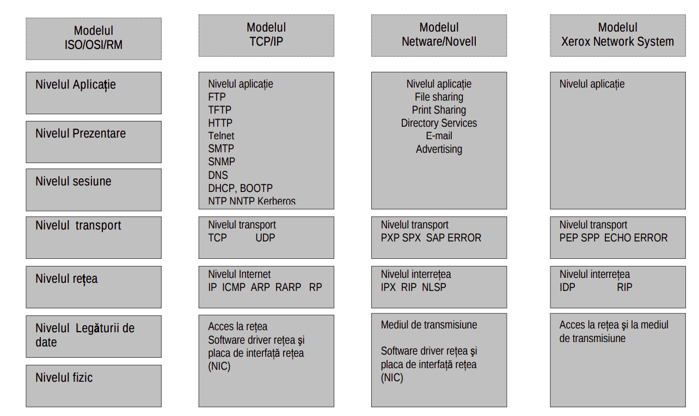
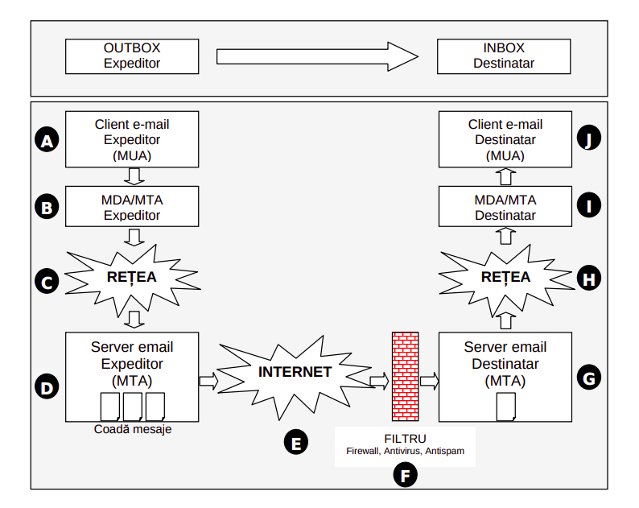
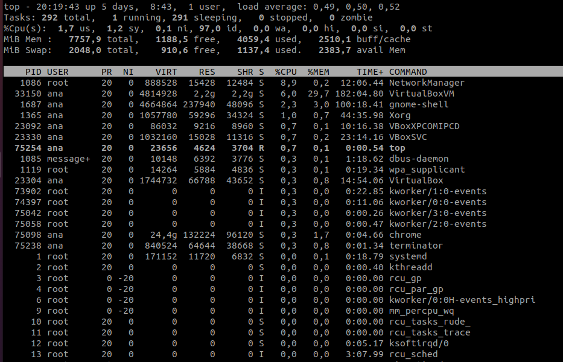
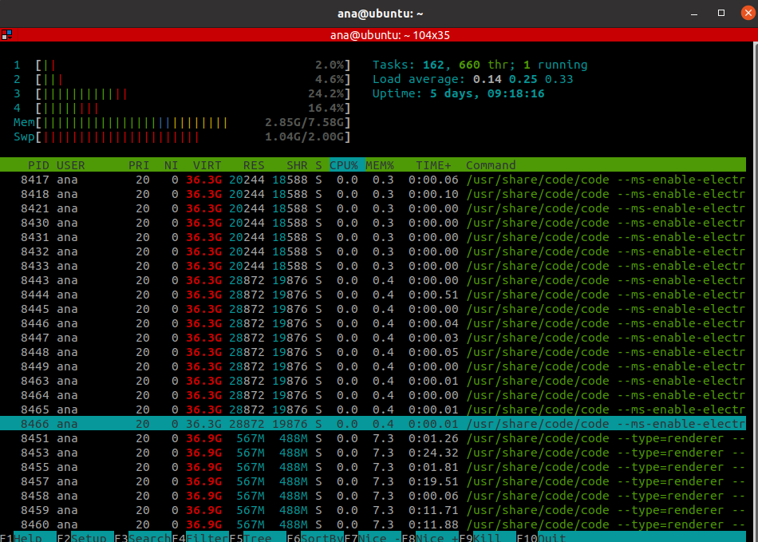
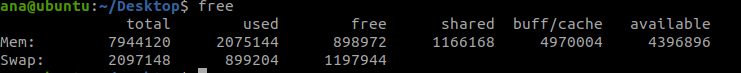
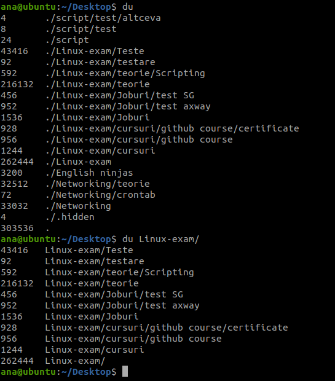
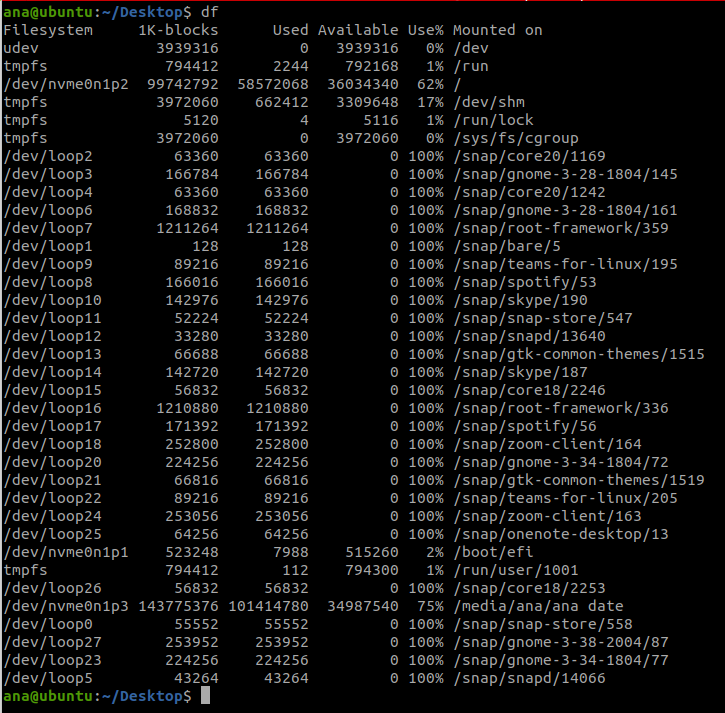
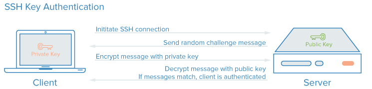

# Networking
Cuprins :
  - [**Capitol 1 - Introducere**](#capitol-1---introducere)
  - [**Capitol 2 - DESCRIEREA TIPOLOGIEI DE RETEA**](#capitol-2---descrierea-tipologiei-de-retea)
  - [**Capitol 3 - ARHITECTURA RETELELOR DE CALCULATOARE**](#capitol-3---arhitectura-retelelor-de-calculatoare)
  - [**Capitol 4 - COMENZI**](#capitol-4---comenzi)
  - [**Capitol 5 - CERTIFICATE SSL**](#capitol-5---certificate-ssl)
  - 
  
  

## **Capitol 1 - Introducere**
Un **server** este orice maşinǎ care poate asigura fişiere, resurse sau servicii si de la care poate fi cerut un fişier. De fapt, aceasta este esenţa sistemelor client/server, unde o maşinǎ (clientul) cere ceva de la alta (serverul). O maşinǎ poate fi atât server cât si client la un moment dat. 

Cea mai întâlnitǎ definitie a server-ului este logatǎ direct de reţelele locale (LAN), server-ul fiind o maşinǎ puternicǎ ce gǎzduieşte toate fişierele şi marile aplicaţii. Celelalte maşini din reţea se conecteazǎ la server pentru a-şi accesa fişierele. În acest tip de reţea o singura maşinǎ se comporta de obicei ca server (toate celelalte fiind clienţi). 

Reţelele bazate pe servere mari pot avea server-e speciale pentru scopuri
specifice. De exemplu un server se poate ocupa de fişierele pentru reţea (server de fisiere), altul se poate ocupa de cererile de tipǎrire (server de tipǎrire), altul se poate ocupa de conexiunile cu reţelele exterioare prin modem-uri (serverul de comunicaţie), si aşa mai departe..Una sau mai multe funcţii de acest tip poate fi pe orice maşinǎ individualǎ din reţea, sau pot exista mai multe maşini într-o reţea mare, care sǎ se comporte ca un anumit fel de server. Pot exista doua server-e de fişiere, de exemplu. 

**Clienţi**

Un client este orice maşinǎ care cere ceva de la server. Într-o definitia mai comunǎ a clientului, server-ul furnizeazǎ fişiere şi uneori putere de calcul cǎtre maşinile mai mici care sunt conectate la el. Fiecare maşinǎ este un client. Astfel, o reţea localǎ tipicǎ de 10 calculatoare poate avea un server mare care sǎ ţinǎ toate fişierele şi bazele de date, şi toate celelalte maşini sǎ se conecteze ca nişte clienţi. 

**Resurse locale şi resurse la distanţă (remote)**

 O resursǎ localǎ este reprezentatǎ de orice dispozitiv care este ataşat de maşina dumnevoastrǎ, aşa cum ar fi o imprimantǎ, modem, scanner sau hard-disk. Deoarece maşina nu trebuie sǎ iasǎ în reţea pentru a ajunge la acel dispozitiv, îl numim un dispozitiv local sau o resursǎ localǎ.
 Urmǎnd aceeaşi logicǎ, orice dispozitiv care trebuie contactat prin intermediul reţelei reprezintǎ o resursǎ la distanţǎ. O imprimantǎ cu laser de mare vitezǎ, care poate face parte din reţea este de asemenea o resursǎ la distanţǎ. 

 **Sistem de operare orientat pe reţele-NOS**

 Un astfel de system (NOS – Network Operating System) controleazǎ interacţiunile dintre toate maşinile din reţea. NOS este responsabil cu controlul felului în care informaţia este trimisǎ prin mediul reţelei. La reţelele mai mari care nu folosesc un singur server, cum ar fi reţeaua Linux ce foloseşte protocolul TCP/IP, NOS poate sǎ facǎ parte din software-ul fiecǎrei maşini. De exemplu, Linux-ul are codul pentru protocolul de reţea TCP/IP inclus în nucleul sistemului, astfel încât este mereu disponibil. Dar un alt PC care vrea sǎ se conecteze la reţeaua TCP/IP trebuie sǎ aibe instalat un pachet software care se ocupǎ de protocolul TCP/IP.

**Protocoale de reţea**

 Protocolul de reţea este numele unui sistem de comunicare prin care maşinile din reţea interactioneazǎ. Pe un sistem Unix protocolul TCP este cel mai folosit. (De fapt TCP/IP este o intreagǎ familie de protocoale). Protocoalele diferite folosesc în mare cam aceeaşi abordare în ceea ce priveşte comunicarea: asambleazǎ informaţiile în blocuri de date numite pachete, pe care le trimit în reţea. Totuşi, felul în care un pachet este construit si tipul informaţiei ataşate precum şi dirijarea sa, diferǎ de la un NOS la altul.

 **Placa de reţea**

 Placa de reţea este un adaptor care de obicei sta intr-un slot înǎuntrul PC-ului si se ocupǎ de conexiunea cu reţeaua insǎşi prin intermediul unuia sau a mai multor conectori aflaţi pe partea superioarǎ a plǎcii. Cei mai comuni conectori de reţea sunt asemǎnǎtori cu mufele de telefon. In cele mai multe cazuri, placa de retea este montata intr-un spatiu special destinat, care apare pe placa de baza (fizica) a dispozitivului. Ea poate fi cablata sau wireless. Finalizarea montajului placii de retea presupune stabilirea conexiunii dintre placa si reteaua corespunzatoare. Astfel, este nevoie de acces la urmatoare informatii:
- IP;
- Network mask;
- Gateway address;
- DNS address.

Fiecare placă de rețea are un număr de identificare hexadecimal unic pe 48 de biți atribuit de către producătorii de hardware numit adresă MAC, de asemenea cunoscut ca o adresă fizică, care este independentă de protocolul de rețea care este utilizat.

 **Punţi, router-e**

Acestea sunt maşini care conecteazǎ douǎ sau mai multe reţele. Diferenţa dintre o punte şi un router este cǎ o `punte` pur şi simplu conecteazǎ douǎ sau mai multe reţele locale care au acelaşi sistem de operare, pe când un `router` conecteazǎ retele locale pe care pot rula sisteme de operare diferite. 

**Port**

Un port (gateway) este o masinǎ care se comportǎ ca o interfatǎ între o reţea micǎ şi una mult mai mare, cum ar fi o reţea localǎ conectatǎ la Internet. Port-urile sunt de asemenea folosite la unele corporaţii mari, de exemplu, pentru a conecta reţele locale ce conecteazǎ birouri la mainframe-ul mai mare al corporatiei. De obicei poarta face legǎtura la un cablu de mare sau medie vitezǎ numit “backbone”. Mai formal, o poartǎ poate sa faca transferuri de protocol între douǎ reţele. Numărul portului este un număr nesemnat pe 16 biți. Poate varia de la 0 la 65535. Port-urile cu numere de la 0 la 1023 sunt cunoscute sub numele de porturi privilegiate și sunt numite și porturi de sistem. Cerințele pentru noile valori din acest interval sunt mai stricte decât pentru alte înregistrări.

**Adrese IP**

Fiecare maşinǎ care este conectatǎ la o reţea bazatǎ pe protocolul TCP/IP trebuie sa fie identificatǎ in mod unic cumva. Fǎrǎ un indentificator unic, reţeaua nu ar şti cum sǎ trimitǎ mesaje la maşina dumneavoastrǎ. Dacǎ ar fi mai mult de o maşinǎ cu acelaşi identificator, reţeaua nu ar şti la cine sǎ trimitǎ un anumit mesaj. Pentru a înţelege adresele IP, care identificǎ în mod unic fiecare masinǎ, este folositor sǎ facem legǎtura cu problema Internet-ului, de a identifica nu numai fiecare maşinǎ, dar şi fiecare organizaţie. 

O adresă IP poate fi `statică` sau `dinamică`. O adresă IP statică este una pe care trebuie să o configurezi manual prin intermediul setărilor de rețea. O adresă dinamică este alocată de către (DHCP), de obicei pentru o perioadă de timp limitată. DHCP este un serviciu care oferit de servere dedicate din rețea sau de dispozitive speciale destinate rețelelor, cum ar fi router-ele wireless.

O adresă **IPv4** este un șir de 32 de biți (4 octeți, sunt reprezentate prin patru numere zecimale, separate prin puncte. Fiecare dintre aceste patru numere conțin între una și trei cifre, iar fiecare număr poate avea o valoare între 0 și 255. De exemplu, o adresă IPv4 ar putea să arate astfel: 172.217.3.100.

**IPv6** este un standard nou care nu este încă foarte răspândit,cu scopul de a înlocui adresele IPv4, dar va fi de îndată ce adresele IPv4 vor fi utilizate în întregime. Adresele IPv6 sunt compuse din opt grupuri de caractere separate prin două puncte (:). Exemplu: 2a00:1450:400d:0802:0000:0000:0000:200e.

 **Netmask** este o metodă de a împărți o rețea IP. Este un fel de prefixul numărului de telefon. În termeni simpli, netmask este utilizat pentru a împărți rețelele în două sau mai multe subrețele, făcându-le mai ușor de gestionat. În rețelele de acasă sau din companiile mici, toate calculatoarele și dispozitivele se află, de obicei, în aceeași subrețea, așa că toate au aceeași netmask.

**DNS-Sistemul numelor de domenii**

Atunci când o companie cu o organizaţie doreşte sa utilizeze Internetul, trebuie sǎ decidǎ dacǎ vor sǎ o facǎ ataşându-se direct la Internet sau dacǎ vor folosi o altǎ companie care sǎ le asigure conexiunea. Multe companii aleg sǎ se foloseascǎ de alte companii, numite prestatoare de sevicii, deoarece aceasta reduce numǎrul echipamentelor şi al costurilor. 
Dacǎ o companie sau organizatie doreşte sǎ se conecteze direct la Internet, s-ar putea sa doreascǎ sǎ aibǎ o unicǎ identificare. De exemplu, compania ABC poate dori ca poşta electronicǎ adresatǎ lor sǎ fie cu numele abc.com. Numele ajutǎ ca expeditorul sǎ identifice compania sau organizaţia. Pentru a obţine unul dintre aceste nume unice, numite “nume de domenii”, compania sau organizaţia trimite o cerere entitǎţii ce controleazǎ accesul la Internet: `DNS` Daca aceasta aprobǎ numele companiei, atunci acesta este adǎugat la baza de date a Internetului. Numele de domenii trebuie sǎ fie unice, pentru a preveni confuziile. 

DNS este un serviciu livrat de familia de protocoale TCP/IP care ajuta la adresarea mesajelor. Când adresaţi un mesaj cǎtre `bozo@clowns_r_us.com`, DNS transforma acest nume symbolic într-o adresǎ IP cautând numele domeniului într-o baza de date. DNS – ul ne permite sǎ uitǎm de adresele IP, permitând nume mai simple: numele de domeniu. Sintaxa uzualǎ pentru a trimite un mesaj este nume_utilizator@nume_domeniu, cum o aratǎ şi exemplul de mai sus. (DNS – ul nu trebuie sa ruleze deasupra protocolului TCP/IP, dar va rula de obicei pe sisteme UNIX.)

**DHCP**

Un server **DHCP (Dynamic Host Configuration Protocol** - protocol de configurare dinamica a gazdei)- poate fi utilizat pentru a furniza automat calculatoarelor dintr-o retea o adresa IP, o masca de subretea (Netmask), o poarta de acces implicita (gateway), un server DNS si un server WINS. Deci DHCP este un protocol de retea de calculatoare folosite de gazde (clienti DHCP) care atribuie adrese IP si alte informatii de configurare de retea importante in mod dinamic.

Serverul DHCP poate avea trei metode de alocare a adreselor IP:

1. `Alocare dinamica` - administratorul de retea atribuie o serie de adrese IP la DHCP. Fiecare computer din retea este configurat sa ceara o adresa de IP de la DHCP in timpul initializarii de retea. Procesul de cerere si aprobare foloseste un concept asemanator cu un contract de leasing pe o perioada determinata, permitand serverului DHCP sa revendice (si sa realoce) adresele IP care sunt disponibile.

2. `Alocare automata` - Serverul DHCP aloca in permanenta o adresa de IP disponibila catre client. Acest proces este asemanator alocarii dinamice, diferenta fiind facuta de faptul ca daca un client a avut o adresa IP aceasta i se va atribui preferential.

3. `Alocarea statica `- Serverul DHCP aloca adresa IP in baza unui tabel cu perechi (adresa MAC/adresa IP), acestea fiind completate manual de catre un administrator al retelei. Numai acei clienti care au adresa MAC in acel tabel vor primi adresa de IP. 

## **Capitol 2 - DESCRIEREA TIPOLOGIEI DE RETEA**

O reţea poate partaja diverse tipuri de resurse:
-  Servicii – cum ar fi imprimarea sau scanare;
-  Spaţii de stocare pe suporturi externe – cum ar fi hard-diskurile;
-  Aplicaţii – cum ar fi bazele de date

Conectivitatea este asigurată de echipamente de reţea (hub-uri, switch-uri, rutere,
puncte de acces wireless)
Transmisia datelor se realizează prin medii de transmisie care pot fi:
- Conductoare de cupru – pentru transmisia datelor sub formă de semnale electrice;
- Fibră optică – din fibre de sticlă sau materiale plastice – pentru a transporta datele
sub formă de impulsuri luminoase;
- Medii de transmisie a datelor fără fir – transmit datele sub formă de unde radio,
microunde, raze infraroşii sau raze laser - în cadrul conexiunilor fără fir (wireless);

O clasificare a reţelelor după criteriul răspândirii pe arii geografice, al modului de
administrare si al mediului de transmisie a datelor ar evidenţia, printre altele , următoarele 3 tipuri de reţele: 
1. *reţele locale de calculatoare (`LAN – Local Area Network`)* -face referire la o reţea de calculatoare interconectate şi supuse aceloraşi politici de securitate şi control a accesului la date, chiar dacă acestea sunt amplasate în locuri diferite (clădiri sau chiar zone geografice). Conexiunile se pot face prin cablu sau wireless.
2. *reţele de întindere mare (`WAN – Wide Area Network`)* - este o reţea de întindere mare este alcătuită din mai multe reţele locale (LAN-uri) aflate în zone geografice diferite. Cel mai popular exemplu de reţea WAN este Internetul, care este format din milioane de LAN-uri interconectate cu sprijinul furnizorilor de servicii de comunicaţii 
3. *reţele fără fir (`WLAN – Wireless Local Area Network`)* -Într-un WLAN, staţiile, care pot fi echipamente mobile – laptop – sau fixe – desktop - se conectează la echipamente specifice numite puncte de acces. Staţiile sunt dotate cu plăci de reţea wireless. Punctele de acces, de regulă routere, transmit şi recepţionează semnale radio către şi dinspre dispozitivele wireless ale staţiilor conectate la reţea.
4. intr-o definiție succintă se poate considera că `Internetul`este cea mai
mare rețea globală aflată în continuă creștere. Însă el este mai mult decât un WAN, constituind o rețea de rețele (comerciale, academice, militare, educaționale, universitare, etc.) și în plus, un imens mediu informațional ce oferă servicii și resurse din domenii vaste.**

Într-o reţea de calculatoare comunicarea are loc între două entităţi: clientul care emite o cerere prin care solicită o anumită informaţie şi serverul care primeste cererea, o prelucreaza iar apoi trimite clientului informatia solicitată. Dacă ar fi să clasificăm reţelele după ierarhia pe care o au într-o reţea echipamentele conectate, ar trebui să facem referire la 2 tipuri de reţele: reţele de tip **peer-to-peer** şi reţele de tip **client-server**.

Reţele client-server, în care un calculator îndeplineşte rolul de server, în timp ce toate celelalte îndeplinesc rolul de client. De regulă, serverele sunt specializate (servere dedicate) în efectuarea diferitelor procesări pentru sistemele-client, cum ar fi:
- Servere de fişiere şi imprimare – oferă suport sigur pentru toate datele şi
gestionează tipărirea la imprimantele partajate în reţea pot fi administrate centralizat;
- Servere web – găzduiesc pagini web;
- Servere pentru aplicaţii – cum ar fi serverele pentru baze de date;
- Servere de mail – gestionează mesaje electronice;
- Servere pentru gestiunea securităţii – asigură securitatea unei reţele locale când aceasta este conectată la o reţea de tipul Internetului – exemple: firewall, proxyserver;
- Servere pentru comunicaţii – asigură schimbul de informaţii între reţea şi
clienţii din afara acesteia.

**Ethernet** este denumirea unei familii de tehnologii de reţele de calculatoare, bazate pe transmisia cadrelor (frames) şi utilizate la implementarea reţelelor locale de tip LAN. Ethernetul se defineşte printr-un şir de standarde pentru cablare şi semnalizare aparţinând primelor două nivele din Modelul de Referinţă OSI.Conceptul şi implementarea Ethernetului s-au dezvoltat permanent, ajungându-se azi la tehnologiile de reţea complexe, care constituie fundamentul majorităţii LAN-urilor actuale. În loc de un mediu (cablu) central, tehnologiile moderne utilizează legături de tipul punct-la-punct, hub, switch (comutator), bridge (punte) şi repeater, bazate pe fire de cupru torsadate care reduc costurile instalării, măresc fiabilitatea şi înlesnesc managementul şi reparaţiile reţelei.

## **Capitol 3 - ARHITECTURA RETELELOR DE CALCULATOARE**

Mulţimea de niveluri şi protocoale se numeste arhitectură de reţea. Există mai multe arhitecturi de reţea: \
• modelul ISO/OSI/RM,\
• modelul TCP/IP, \
• modelul Netware/Novell \
• modelul Xerox Network System. 

- `MODELUL OSI` (International Standardization Organization) defineşte un cadru general pentru reţelele de calculatoare prin implementarea protocoalelor de reţea în şapte straturi si descrie modul în care se pot combina diverse dispozitive pentru a comunica intre ele.

- `MODELUL ARHITECTURAL TCP/IP` - Desi modelul OSI este universal recunoscut, standardul aplicat comunicării într-o reţea (sau între reţele) este TCP/IP, adică Transmission Control Protocol/Internet Protocol. TCP/IP (Transmission Control Protocol/Internet Protocol) este cel mai utilizat protocol folosit în reţelele locale cât şi pe Internet datorită disponibilităţii şi flexibilităţi lui având cel mai mare grad de corecţie al erorilor. TCP/IP permite comunicarea între calculatoarele din întreaga lume indiferent de sistemul de operare instalat.

Tradiţional, Internet-ul a fost proiectat pentru patru aplicaţii/servicii principale, după cum urmează:\
• Poşta electronică;\
• Ştiri;\
• Conectare la distanţă;\
• Transfer de fişiere. 

Până la începutul anilor 1990 Internet-ul a fost foarte populat cu cercetări din domeniul academic, guvernamental şi industrial.
O aplicaţie nouă, `WWW (World Wide Web)`, a schimbat toată situaţia şi a adus în reţea milioane de noi utilizatori.
Clienţii, serverele, imprimantele, bazele de date relaţionale, dispozitivele de interconectare formează componentele unei reţele locale. Acestea realizează încapsularea şi decapsularea datelor pentru a-şi îndeplini toate sarcinile (transmitere e-mail-uri, editare texte, scanare, acces la baze de date). 

Fiecare pagină Web are o adresă Web (URL - Uniform Resource Locator), ce descrie în mod unic localizarea pe “harta” Internet-ului a respectivei pagini. URL-urile sunt folosite de World Wide Web pentru a specifica “adresele” fişierelor pe alte servere, reprezentând punctul cheie al localizării şi interpretării informaţiilor din Internet. URL-urile sunt un mod standard de descriere atât a
locaţiei unei resurse Web, cât şi a conţinutului acesteia. 

`Limbajul HTML` utilizează o sintaxă standard pentru exprimarea unui URL. Forma generală este următoarea:\
nume_serviciu://gazdă_Internet:număr_port/resursă

3 părţi distincte ale acestei sintaxe:
- numele serviciului (tipul resursei);
- gazda Internet (numele serverului) şi numărul portului necesar accesării resursei (uneori);
- numele fişierului (resursa).

Tipuri URL:\
• URL-uri de tip http (hypertext transfer protocol):http://server/cale/fisier.html\
• URL-uri de tip mailto (pentru legătură către o adresă de email): mailto:webmaster@www.adresa_server.ro\
• URL-uri de tip ftp (file transfer protocol): ftp://server/cale/ \
• URL-uri de tip file (pentru accesarea unei resurse aflate pe harddisk-ul local): file://folder/cale/document1.doc\

### **Serviciu de internet WORLD WIDE WEB**
World Wide Web-ul este o componenta a Internet-ului, acesta încorporand si alte metode de a “lega” computere, si, implicit, pe utilizatorii lor: E-mail, Telnet, File Transfer Protocol, si Gopher ( serviciile de e-mail si Web-ul ramân însa partile Internet-ului cu cea mai frecventa utilizare ). Acesta reprezinta un set de programe, standarde si protocoale, toate reglementand modul in care fisierele multimedia ( documente care pot contine texte, fotografii, grafice, secvente video si audio) sunt create si afisate pe Internet. \
Metodele Web de stocare a informatiei în mod asociat, prin accesarea documentelor prin hiperlink-uri, si numirea site-urilor
Web cu URL-uri fac din Web o extensie simpla a restului Internetului. Aceasta determina un acces facil la informatie între diferitele
servicii de Internet. Web-ul ofera, de asemenea, si un spatiu unde companiile, organizatiile si indivizii pot etala informatii despre
produsele, resursele si vietile lor, si oricine care are acces la un computer conectat la Internet poate dispune de aceste informatii – un
mic procent al informatiilor de pe Web sunt disponibile numai utilizatorilor autorizati. 

FUNCTIONARE\
• Web-ul se bazeaza pe conexiunile dintre doua tipuri de computere: clienti si servere, utilizând un set standard de legi pentru a reglementa comunicarea dintre acestea. In acest tip de arhitectura, unele computere se comporta ca un server, o baza de date, in timp ce altele se comporta ca niste clienti, ca solicitatori si receptori ale acelor date.

• pentru a accesa informatii de pe Web, respectiv Internet, un utilizator / statie-client trebuie sa se conecteze la un computergazda / host – reteaua din care PC-ul / statia-client face parte ( de obicei, o retea locala / de tip LAN).

• difera de celelalte servicii Internet prin regulile utilizate de computere pentru a comunica si prin accesibilitatea informatiilor, mai ales acelor informatii care nu sunt de tip text. Este mult mai dificil sa accesezi imagini sau alte fisiere multimedia prin alte metode decât prin Web. Statiile-client pot accesa acest tip de informatii prin instalarea unui tip de software numit browser / Web Browser – un program care confera posibilitatea unui computer de a localiza, downloada si afisa documente continand text, sunet, imagini, animatii, grafica si fotografii din cadrul diferitelor retele de computere. 

• codurile care instruiesc browser-ul cum sa citeasca informatia Web corespund setului de reguli numit Hypertext Markup Language ( HTML ). Hypertext Markup Language (HTML) reprezinta limbajul standard de formatare a textului folosit incepand cu 1989 pentru documentele de pe World Wide Web. 

### **Serviciu de internet posta electronica (e-mail)**
Structura unei adrese e-mail este similară pentru toţi utilizatorii şi arată astfel: `nume_utilizator@domeniu` , unde nume_utilizator este identificatorul unic al utilizatorului pe serverul e-mail identificat prin domeniu (de asemenea unic). 

a) Suportul pentru trimiterea şi primirea mesajelor e-mail este asigurat de un server e-mail (calculator pe care rulează o serie de programe ce permit utilizarea protocoalelor specifice pentru gestiunea mesajelor de poştă electronică). Pentru trimiterea mesajelor (de la client la server şi între servere) se foloseşte protocolul **SMTP** (Simple Mail Transfer Protocol),  
b) SUport pentru primire protocoalele **POP3** (Post-Office Protocol versiunea 3) sau **IMAP** (Internet Message Access Protocol). 

Client-email : Windows -Outlook , Linux - Mozilla Thunderbird,
Cele mai populare servere publice accesate via web sunt Yahoo, Gmail, Windows Live. Interfaţa Web se poate instala pe orice server de email pentru a facilita accesul la corespondenţă, acolo unde nu este posibilă instalarea unui client e-mail. 

**DETALIERE MODEL TCP/IP**\
Un mesaj porneşte de la nivelul superior (nivelul Aplicaţie) şi traversează de sus în jos cele patru niveluri până la nivelul inferior (nivelul Acces reţea). Informaţiile din header sunt adăugate la mesaj în timp de acesta parcurge fiecare nivel, apoi mesajul este transmis. După ce ajunge la destinaţie, mesajul traversează din nou, de data aceasta de jos în sus fiecare nivel al modelului TCP/IP.

## 1. *Nivelul Aplicaţie*
identifică şi stabileşte disponibilitatea partenerului de comunicaţie, sincronizează aplicaţiile între ele şi stabileşte procedurile pentru controlul integrităţii datelor şi erorilor. De asemenea identifică dacă există suficiente resurse pentru a sprijini comunicaţia între parteneri.

Câteva din protocoale de la acest nivel care fac posibilă comunicarea sunt:

1.1. Protocolul **HTTP (Hyper Text Transfer Protocol)** - utilizat pentru a transmite informaţii între un program de navigare Web (browser) şi un server Web, fiind un protocol de tip text (hypertext). Prin hypertext se înţelege o colecţie de documente unite între ele prin legături (link) ce permit parcurgerea acestora bidirectional. HTTP permite aducerea pe calculatorul local a unor documente HTML (Hyper Text Markup Language), fişiere grafice, audio, animaţie sau video, programe executabile pe server sau un editor de text. Este softul utilizat de browsere (Internet Explorer, Safari, FireFox … ) pentru aducerea paginilor web pe calculatorul propriu, fiind protocolul implicit al www. Există HTTP server (furnizează pagini web) şi HTTP client (cere pagini web). 

*Mod de funcţionare:* Serverul HTTP aşteaptă, pe portul 80, cereri de la clienţi (navigator / browser), care sunt de fapt adrese ale documentelor dorite. Clientul primeşte un document în mod text şi dacă găseşte în el legături către imagini şi le vrea şi pe acestea le cere. Astfel transferul unei pagini hipertext constă de fapt în una sau mai multe sesiuni de transfer informaţie de la şi către serverul HTTP. După primirea informaţiilor, browser-ului hotărăşte în ce format acestea vor fi afişate. Aplicaţiile care folosesc acest protocol trebuie să poată formula cereri şi/sau recepţiona răspunsuri (modelul client-server).

1.2. Protocolul **HTTPS** (Secure Hyper Text Transfer Protocol ) reprezintă protocolul HTTP încapsulat într-un flux SSL/TLS. SSL înseamnă protocolul
Secure Sockets Layer, un protocol de securitate care asigură comunicaţii confidenţiale prin Internet. SSL permite aplicaţiilor client/server
să comunice în aşa fel încât să fie evitată interceptarea, modificarea sau falsificarea mesajelor. HTTPS nu este altceva decât HTTP "încapsulat" cu ajutorul unui flux SSL/TLS - datele sunt criptate la server înainte de a fi trimise clientului. HTTPS este în acelaşi timp o metodă de autentificare a server-ului web care îl foloseşte, prin intermediul aşa-numitelor
"certificate digitale"- o colecţie de date pe care un browser o solicită server-ului pentru a putea începe transferul criptat; dacă certificatul
este emis de o autoritate cunoscută, browser-ul poate fi sigur că server-ul cu care comunică este ceea ce pretinde a fi. 

1.3. **FTP (File Transfer Protocol)** - oferă facilităţi pentru transferul fişierelor pe sau de pe un calculator din reţea. FTP este cea mai folosită metodă pentru transferul fişierelor de la un calculator la altul, prin intermediul Internetului, indiferent de tipul şi dimensiunea acestora.

Pentru a se realiza transferul fişierelor este necesar să existe:
- FTP server – care este instalat de administratorul de reţea pe un calculator care astfel devine server FTP. Prin FTP server administratorul de sistem creează conturi FTP şi stabileşte în ce zonă se poate conecta clientul şi ce poate face în acea zonă;
- FTP client - care este instalat pe un alt calculator care astfel devine client FTP.

Transferul poate fi de două tipuri:
- Upload - fişierele sunt transferate de pe calculatorul local pe cel de la distanţă;
- Downlod- fişierele sunt transferate de pe calculatorul aflat la distanţă pe cel local;

Clienţii ftp sunt programe dedicate care permit accesul la un server ftp printr-o interfaţă grafică, si pot fi programe gratuite (Filezilla, WinSCP, Classic FTP, cURL) sau programe comerciale (BulletProof FTP, CuteFTP, SmartFTP, WS FTP).

Browserele web pot fi folosite de asemenea pentru accesarea unui server ftp. La tastarea unei adrese de tip ftp, browserul va afişa,
direct sau după solicitarea username-ului şi a parolei (în funcţie de configurarea serverului), lista directoarelor şi a fişierelor. Exemple:

ftp://ftp.roedu.net\
ftp://< login>:< password>@< ftp server address>:< port>

Mozilla Firefox permite chiar instalarea unei extensii denumită FireFTP, un client ftp foarte mic şi rapid. 

1.4. **SMTP (Simple Mail Transfer Protocol)**- folosit pentru a transmite un mesaj electronic de la un client la un server de poştă electronică, după stabilirea conexiunii TCP la portul 25 (utilizat de SMTP). 

MECANISM DE LUCRU

A. Expeditorul creează mesajul e-mail într-un MUA (Mail User Agent) - clientul folosit pentru crearea şi citirea e-mailului sau interfaţa web folosită în aceste scopuri. Exemple: pine, elm, mutt (Linux), Outlook, Thunderbird, TheBat! (Windows)\
B. Mesajul este trimis către MTA (Mail Transport Agent, denumit şi smtpd - SMTP daemon). MTA este responsabil doar de trimiterea unui mesaj de la un computer la altul. El poate primi mesaje de la un alt MTA (relay) sau de la un MUA. Exemple de aplicaţii MTA sunt sendmail, postfix, exim, qmail (pe sisteme Linux) sau Microsoft Exchange Server (sisteme Windows).\
C. În funcţie de destinaţia mesajului (în aceeaşi reţea sau din altă reţea), e-mailul trece prin reţeaua companiei ("Compan Network") şi prin reţeaua mondială ("The Internet"). \
D. Mesajul aşteaptă în coada serverului MTA ("email queue") până când va fi expediat.\ 
E. MTA-ul expeditorului se va ocupa de toate aspectele furnizării mesajului până la destinaţie, unde va primi acceptare sau respingere din partea MTA-ului destinatarului. Mesajul trece prin mai multe servere, MTA cerând de fiecare dată de la sistemul DNS (Domain Name System) adresa următorului server în drumul spre destinatar. MTA comunică prin protocolul SMTP (de unde şi numele de SMTP server sau outgoing mail servers).\
F. Până să ajungă la MTA-ul destinatarului, mesajul poate trece prin mai multe filtre, în ordine: firewall (sistem de protecţie al serverului), antivirus (program care scanează mesajul de viruşi şi alte aplicaţii gen malware) şi antispam (program de filtrare a mesajelor nesolicitate).\
G. Dacă trece de filtre, mesajul ajunge în MTA-ul destinatarului.\
H. Mesajul sosit în MTA trece (eventual) prin reţeaua companiei sau ajunge direct la MDA-ul destinatarului.\
I. Mesajul este preluat de un MDA (Mail Delivery Agent), un program ce se ocupă de pregătirea mesajului pentru a fi livrat în căsuţa poştală a destinatarului, imediat cum acesta soseşte pe server. MTA şi MDA sunt implementate de obicei de acelaşi program sau pachet. Cele mai folosite MDA sunt procmail şi maildrop.
J. Destinatarul citeşte mesajul printr-un client email (MUA) sau folosind interfaţa web. Dacă se utilizează un client email, mesajul poate fi accesat prin două protocoale:
a. POP3 (mai vechi, este folosit pentru aducerea mesajelor şi eventual lăsarea unei copii pe server)
b. IMAP, păstrează implicit o copie pe server şi permite o bună gestionare a stării mesajelor (citit, şters, mutat), astfel sincronizarea lor poate fi efectuată uşor.

Pentru a verifica daca serverul de e-mail este disponibil si corect configurat se testeaza portul SMTP (25) sau portul POP3 (110) cu comanda telnet. Se poate folosi urmatoarea comanda, introdusa in linia de comanda a sistemului Linux sau Windows, pentru testarea serverului de e-mail de la IP-ul respectiv : telnet 192.168.1.1 25

1.5. **DNS (Domain Name System)** – traduce adresele Internet literale în adrese Internet numerice, adrese utilizate de un calculator pentru a găsi un calculator receptor.Baza de date DNS se numeşte distribuită deoarece nu există un singur server care să aibă toată informaţia necesară traducerii oricărui domeniu într-o adresă IP. Fiecare server are o bază de date cu propriile domenii, la care au acces toate sistemele de pe Internet. Fiecare server DNS are un server DNS superior cu care face periodic schimb de informaţie.Componente DNS sunt următoarele: Servere DNS - Un server DNS este o staţie pe care rulează un program de server DNS.

Pentru a stabili corespondenţa dintre un nume şi o adresă IP, programul de aplicaţie apelează un resolver, transferându-l numele ca parametru, resolverul trimite un pachet UDP (printr-un protocol de transport fără conexiune) la serverul DNS local, care caută numele şi returnează adresa IP către resolver, care o trimite mai departe apelantului.
Înarmat cu adresa IP, programul poate stabili o conexiune TCP cu destinaţia sau îi poate trimite pachete UDP.

1.6. **DHCP (Dynamic Host Configuration Protocol)** - permite calculatoarelor dintr-o reţea să obţină automat o adresă IP, printr-o cerere către serverul DHCP. Serverul poate să furnizeze staţiei respective toate informaţiile de configurare necesare, inclusiv adresa IP, masca de subreţea, default gateway, adresa serverului DNS, etc. 

1.7. **SNMP (Simple Network Management Protocol)** - permite administratorilor de reţea gestionarea performanţelor unei reţele, identificarea şi rezolvarea problemelor care apar, precum si planificarea dezvoltărilor ulterioare ale reţelei.

1.8. **Telnet** (Telecommunication network) - terminale virtuale - este o aplicaţie destinată accesului, controlului şi depanării de la distanţă a calculatoarelor şi a dispozitivelor de reţea. Acest protocol permite utilizatorului să se conecteze la un sistem de la distanţă şi să comunice cu acesta printr-o interfaţă. Folosind telnetul, comenzile pot fi date de pe un terminal amplasat la distanţe foarte mari faţă de computerul controlat, ca şi când utilizatorul ar fi conectat direct la acesta. Se asigură o conexiune logică între cele două echipamente: cel controlat şi cel folosit ca terminal numită sesiune telnet.

Pentru a se realiza accesul este necesar să existe:
- Telnet server - instalat de administratorul de reţea pe un calculator care astfel devine server Telnet. Prin Telnet server administratorul de sistem creează conturi Telnet (username şi parolă ) şi stabileşte în ce zonă se poate conecta clientul şi ce poate face în acea zonă;
- Telnet client - instalat pe un alt calculator care astfel devine client Telnet. Softul Telnet client deschide canalul de comunicaţii cu serverul şi realizează conectarea la calculatorul server.

Datorită problemelor de securitate avute (Telnet nu cripta niciun fel de dată transmisă – parole sau date efective), utilizarea protocolului Telnet a scăzut în favoarea protocolului SSH (Secure Shell) lansat în 1995. Acesta aducea o criptare puternică, pentru a se evita posibila interceptare a datelor şi o autentificare cu chei publice pe sistemul dorit.
Printre clienţii ssh populari se numără: PuTTY şi WinSCP.

1.9. **SSH (Secure Shell)** – un protocol de rețea criptografic ce permite ca datele să fie transferate folosind un canal securizat intre dispozitive de rețea. Folosit cu precădere în sistemele de operare multiutilizator linux și unix, SSH a fost dezvoltat ca un înlocuitor al Telnet-ului și al altor protocoale nesigure de acces de la distanță, care trimit informatia, în special parola, în clar, făcând posibilă descoperirea ei prin analiza traficului. Criptarea folosită de SSH intenționează să asigure confidențialitatea și integritatea datelor transmise printr-o rețea nesigură cum este Internetul. Ascultă pe portul 22.

## 2. *Nivelul Transport: TCP/IP sau UDP*
administrează transmisia de date de la un computer la altul, asigurând calitatea serviciului de comunicare, siguranţa liniei de transport, controlul fluxului, detecţia şi corecţia erorilor. Una dintre funcţiile acestui nivel este de a împărţi datele în segmente mai mici pentru a fi transportate uşor prin reţea. El este proiectat astfel încât să permită conversaţii între entităţile pereche din gazdele sursă, respectiv, destinaţie.

   
Nivelul transport include protocoale:
   
2.1.  **TCP** - protocol orientat pe conexiune care permite ca un flux de octeţi trimişi de la un calculator să ajungă fără erori pe orice alt calculator din Internet. Dacă pe calculatorul destinaţie un pachet ajunge cu erori, TCP cere retrimiterea acelui pachet. După ce sesiunea a fost stabilită, destinaţia trimite confirmări la sursă pentru fiecare segment pe care îl primeşte. Când sursa primeşte o confirmare, se ştie că datele, pentru care s-a primit respectiva confirmare, au fost livrate cu succes şi astfel se poate încheia urmărirea acelor datele. În cazul în care sursa nu primeşte o confirmare în cadrul unei sume prestabilite de timp, se retransmit datele către destinaţie.

Cîteva dintre cele mai cunoscute aplicaţii care sunt transmise cu ajutorul
protocolului TCP sunt prezentate (prin intermediul numerelor de port) în tabel:

2.2. **UDP - (User Datagram Protocol)**, protocol nesigur, fără conexiuni, destinat aplicaţiilor care doresc să utilizeze propria lor secvenţiere şi control al fluxului. Protocolul UDP este de asemenea mult folosit pentru interogări rapide întrebare-răspuns, client-server şi pentru aplicaţii în care comunicarea promptă este mai importantă decât comunicarea cu acurateţe, aşa cum sunt aplicaţiile de transmisie a vorbirii şi a imaginilor video. Atunci când o aplicaţie are de transmis date, acesta trimite pur şi simplu acele date.
O parte din protocoalele nivelului Aplicaţie ce utilizează UDP sunt următoarele:\
DNS (Domain Name System);\
SNMP (Simple Network Management Protocol);\
DHCP (Dynamic Host Configuration Protocol);\
RIP (Routing Information Protocol);\
TFTP (Trivial File Transfer Protocol);

Datele trimise către o destinaţie trebuie să specifice pe langă adresa logică (IP-ul) a calculatorului şi procesul căreia îi aparţine informaţia respectivă. Identificarea proceselor se realizează prin intermediul porturilor. Un port este un număr pe 16 biţi care identifică în mod unic procesele care rulează pe o anumita maşină. Orice aplicaţie care realizează o conexiune în reţea va trebui să ataşeze un număr de port acelei conexiuni. Valorile pe care le poate lua un număr de port sunt cuprinse intre 0 si 65535 (deoarece sunt numere reprezentate pe 16 biţi).

## 3. *Nivelul Internet - IP Protocol*
identifică cea mai buna cale pe care trebuie sa o urmeze un pachet pentru a ajunge la destinaţie şi cel de a controla sosirea lor la destinaţie indiferent de traseul sau reţelele traversate până la destinaţie. Protocolul specific care guvernează acest nivel se numeşte `Protocol Internet (IP)`. 

În acest nivel se realizează alegerea căii optime şi distribuirea pachetelor. Acesta este locul unde acţioneaza routerul în internet. IP asigură rutarea pachetelor de la o adresă sursă la o adresă destinaţie, folosind şi unele protocoale adiţionale, precum ICMP sau IGMP.Comunicarea la nivelul IP este nesigură, sarcina de corecţie a erorilor fiind plasată la nivelurile superioare -  protocolul TCP.

## 4. *Nivelul Acces la Reţea*
Nivelul de reţea este responsabil de transmiterea informaţiilor de lungime
variabilă (unitate de protocol numită pachet) de la echipamentul sursă până la cel destinaţie reţelele de calculatoare, echipamente identificate prin adrese unice. Câteva din protocoalele specifice nivelului reţea sunt: Internet Protocol (IP) versiunea 4, IP versiunea 6, Internet Control Message Protocol (ICMP) versiunea 4 şi versiunea 6, Internet Protocol Security (IPsec), etc.
Modelul de comunicaţie este cel fără conexiune, în care pachetele sunt trimise
către destinaţie fără a verifica în prealabil disponibilitatea acesteia. Acest lucru are avantajul că datele sunt trimise la destinaţie cât mai repede posibil însă poate duce la pierderea pachetelor in cazul in care echipamentul destinaţie nu este pregătit să le recepţioneze.

Echipamentele folosite în reţele de calculatoare la acest nivel sunt `ruterele`. Ruterele iau decizii privind traseele pe care le urmează pachetele în reţea, din acest motiv ele trebuie să despacheteze informaţia până la acest nivel, să ia decizia legată de traseul pe care aceasta trebuie să îl urmeze şi să reîmpacheteze informaţia în mod corespunzător.

4.1. **Protocolul IPv4**\
Internet-ul poate fi definit ca o reţea de reţele, care utilizează suita de protocoale TCP/IP. La nivel abstract, internet-ul este foarte asemănător cu reţeaua telefonică. Dar dacă, în cazul reţelei telefonice, pentru fiecare convorbire se alocă un circuit separat, în căzui internet-ului mai multe
procese folosesc în comun aceleaşi legături dintre calculatoare.

Principalalul protocol al nivelului retea este `protocolul IP`. Acesta este un protocol fără conexiune, care asigură o transmisie nefiabilă a pachetelor de date. Un astfel de protocol este caracterizat prin faptul că fiecare pachet este considerat o entitate independentă, care nu are legătură cu celelalte pachete transmise. Fiecare pachet de date, contine atât adresa IP a calculatorului sursă, cât si adresa IP a calculatorului destinatie, astfel încât poate fi transmisă si rutată independent de celelalte pachete. În momentul de faţă, doreste extinderea implementarii la noua generaţie de protocoale IP, numite şi IP v6 (care are caracteristici mai bune de securitate si suporta conectarea si identificarea unui numar mult mai mare de calculatoare).
Pentru a identifica un calculator la nivelul internetului se folosesc adresele IP. Se
folosesc 2 versiuni:
- IPv4 are adresele pe 32 de biţi care sunt grupați în 4 grupuri a câte 8 biţi, iar scrierea
numerelor se face in baza 10
- IPv6 are adrese pe 128 de biţi , iar scrierea numerelor se face in baza 16, in grupuri de
cate 4 cifre hexazecimale.

Orice adresă IP este formată din două părti, una care identifică reţeaua (Network ID) şi una care identifică nodul sau gazda (Host ID). Încercarea de a păstra reprezentarea zecimală ca model de referinţă pentru adresa IP şi de a permite să se facă uşor distincţia între cele două componente ale adresei IP, a condus la definirea claselor de adrese IP.

Au fost definite 5 clase diferite de adrese IP: A, B, C, D si E. Se poate determina clasa din care face parte adresa IP prin examinarea primilor 4 biţi ai adresei IP:

    1. Clasa A : 0.0.0.1 - 126.255.255.255 ;(Clasa de adrese 0.0.0.0 nu este folosită datorită posibilelor confuzii cu rutele implicite, iar clasa 127.0.0.0 este rezervată pentru adrese de loopback, în scopul monitorizării şi testării reţelei locale.)
    2. Clasa B : 128.0.0.0 - 191.255.255.255 
    3. Clasa C : 192.0.0.0 - 223.255.255.255 
    4. Clasa D : 224.0.0.0 - 239.255.255.255 
    5. Clasa E : 240.0.0.0 - 254.255.255.255 
      
IANA (Internet Asigned Numbers Authority) a definit ca spaţiu de adresare privată intervalele, adresele IP private sunt următoarele::

    • 10.0.0.0 - 10.255.255.255 (clasa A);
    • 172.16.0.0 - 172.31.255.255 (clasa B);
    • 192.168.0.0 - 192.168.255.255 (clasa C)

Pentru a conecta o rețea cu adrese private la internet este necesar un ruter care să facă translatarea în adrese publice și reciproc. Procedeul de transformare a adreselor private în adrese publice se numește NAT (Network Address Translation). Scopul adreselor private este să permită fiecărei organizații să aibă la dispoziție un număr mare de adrese locale, independent de numărul de adrese publice care îi sunt alocate.

4.2. **Protocolul IPv6**\

4.3. **Internet Control Message Protocol (ICMP)**

Comanda ping foloseşte protocolul ICMP, deci un calculator poate fi configurat
să nu răspundă la acest tip de pachete dacă se configurează regulile de filtrare
coerspunzatoare.

Configurare ruter în Linux

În sistemul Linux adaptorul de reţea are denumiri speciale în funcţie de tipul
conexiunii. Avem urmatoarele denumiri folosite pentru identificarea adaptorului de retea:\
Loopback – prescurtarea lo.\
Ethernet – eth0,eth1,lan0,lan1.\
Wireless – wlan0,wlan1,…\
Token Ring – tr0,tr1.\
Seriale – ppp0, ppp1 (ppp – point to point protocol – folosit pentru comunicatiile prin liniile analogice de telefon (de ex. modem-uri)

## **Capitol 4 - COMENZI**

INSTALRE PROGRAME SERVER/CLIENT:
1. `sudo apt install vsftpd` - instalare program-server FTP
2. `sudo apt install filezilla` - instalare program-client
3. `sudo apt-get install apache2` - instalare server HTTP
4. `sudo apt-get install Netcat` - instalare program-server care poate fi folosit si ca program-client TCP. Ofera posibilitatea de a copia fisiere prin retea fara a avea un server FTP sau HTTP, sau orice alt serviciu care permite transmiterea datelor. Ambele computere trebuie sa aiba nc instalat.

ACCES FISIER DE CONFIGURARE:

1. `sudo nano /etc/vsftpd.conf` -configurare server

SERVICE LINUX : service --status-all

- `sudo service httpd stop` - oprire server 
- `sudo service httpd start` - pornire server

- `sudo service vsftppd stop` - oprire server 
- `sudo service vsftpd start`- pornire server

- `sudo service apache2 stop` - oprire server 
- `sudo service apache2 start` - pornire server

- `sudo service ssh stop` - oprire server 
- `sudo service ssh start` - pornire server

IDENTIFICARE SETARI DE RETEA : `ifconfig`

VERIFICARE DACA SERVER-ul ESTE PORNIT/RULEAZA: `ps -aux | grep "<server>"`

PORNIRE SERVER : `sudo service <Server> start`cf listei service --status-all

VERIFICARE CONEXIUNI DE RETEA : `sudo netstat -tnlp`

VERIFICARE DACA SE ASCULTA PE UN ANUMIT PORT : `sudo netstat -tlnp <Port>`

ERIFICARE TOATE CONEXIUNILE STABILITE : `sudo netstat -anp | grep "<Port/Server>"`

VERIFICARE DACA PROGRAMUL-CLIENT POATE ACCESA RETEAUA UNDE SE AFLA SERVER-UL : `ping <Ip server> `

Inchidere proces fortat: `kill -9 <pid process care foloseste portul urmarit>`

Acces la fisierul de log al calculatorului Ubuntu: `cd /var/log/syslog`

Acces la fisierul de log al serverului vsftpd : `cat /var/log/vsftpd.log`

Acces la fisierul de log al server-ului SSH : `cat /var/log/auth.log`

Utilizare SSH - conectare la distanta pe o alta masina:
1. exemplu : `ssh ana@192.168.100.14`
2. Iesire :  `exit`

Rulare programe in mod automat in anumite zile, la anumite ore: `crontab -e`
- minute: 0 – 59
- ora: 0 – 23
- ziua-din-lună: 0 – 31
- luna: 1 - 12 (12 == decembrie), sau jan, feb, mar,…
- ziua-din-săptămână: 0 - 6 (0 == duminică), sau sun, mon, tue, wed, thu, fri, sat

Folosirea comenzii NETCAT:
1. In calitate de program-server pentru comunicare : `nc -k -l <nr port>`
2. In calitate de program-client pentru comunicare : `nc -v <Ip>  <Port>` sau cu `telnet <Ip> <Port>`
3. In calitate de program-server pentru transfer fisier : `nc -k -l <Port>   > file.txt`
2. In calitate de program-client pentru transfer fisier ab.txt: `cat ab.txt | nc -v <Ip>  <Port>`
4. Inchiderea conexiunii : `CTRL +C`

Folosirea programului-client Filezilla:
1. instalare aplicatie `sudo apt-get install filezilla`
2. logare : HOST(adresa IP) => username(ana) => password (...)
3. tranfer de fisiere dintr-o parte din alta - drag and drop
   
Pentru a primi conexiuni de la clienti locali (din aceeasi retea), se poate folosi IP de la LOOPBACk 127.0.0.1

Alte comenzi testare networking:
1. `speedtest` 
2. `sudo apt install iperf` -Instrumentul iPerf oferă multe opțiuni pentru testarea vitezei de conectare între un server și un client. Prin urmare, pentru a efectua un test, trebuie să instalați utilitarul pe ambele mașini
3. `host google.com` - Aflați serverul de e-mail și de nume pentru domeniul google.com
4. `iperf -s` - rulare ca server pentru a afisa latimea de banda a conexiunii
5. `ipserf -c <IP server>` - rulare ca si client pentru a afisa latimea de banda a conexiunii.Iperf va rula 10 secunde în mod implicit și va genera ieșire pe client, raportând lățimea de bandă a conexiunii dvs. în megabiți pe secundă pentru fiecare secundă a testului, cu media pentru întregul test în partea de jos. Amintiți-vă, megabiții sunt diferiți de megabiți; 1 megabyte (MB) este egal cu 8 megabiți (Mb). _Bandwidth_ (Lățimea de bandă): Aceasta arată rata de viteză cu care sunt transferate datele.
6. `ping` -este folosită pentru a testa funcţia de transmitere şi recepţie a plăcii de reţea, configurarea protocolului TCP/IP, şi conectivitatea reţelei. Următoarele tipuri de comenzi ping pot fi utilizate:
- `ping 127.0.0.1` –test de loopback intern.
- `ping adresa IP a computerului gazdă` – un ping către un PC verifică
configurarea adreselor TCP/IP şi conectivitatea între gazde.
- `ping default-gateway IP address` – un ping către adresa implicită de
gateway indică dacă router-ul care conectează reţeaua locală cu alte reţele este atins.
- `ping adresa IP a unui PC îndepărtat` – verifică conectivitatea cu calculatorul îndepărtat. 
- `nmap <IP>` - scanare port-uri deschise 
- `top` - o versiune dinamică a comenzii ps este top. Prestabilit, top sortează intrările după folosirea procesorului și face actualizarea la fiecare 3 secunde. Este o unealtă utilă pentru stabilirea proceselor care îngreunează sistemul - acestea apar, de regulă, pe primele poziții.

%CPU- procentajul folosit de procesor pentru acel proces.\
%MEM- cât la sută din memorie folosește acel proces.\
TIME- arată cât timp a consumat procesorul rulând acel proces.\
COMMAND- comanda folosită pentru a lansa acel proces.

Tasta **s** :Pentru a modifica timpul la care se face actualizarea+ ENTER\
Tasta **k** : Pentru a termina un proces, scriem numărul procesului și ENTER de 2 ori.\
Tasta **M**: sortarea după memoria folosită.\
Tasta **P**: revenirea la sortarea default, după procesor.\
Tasta **q** :pentru a ieși

- `comanda htop` - peste o variantă îmbunătățită a top si are 3 secțiuni importante:\
a) Header-ul, unde putem vedea informații despre CPU, Memorie și Swap; de asemenea, aici sunt afișate numărul de sarcini, încărcarea medie a serverului și timpul de când acesta rulează (up-time);\
b) Lista proceselor ordonate după utilizarea procesorului;\
c) Footer-ul prezintă diferite scurtături, cum ar fi help, setup, search, filter, sort by, nice, kill, quit.

Tasta F2 sau S :Pentru meniul Setup\
Tasta F5 sau T : pentru a vizualiza procesele într-o structură arborescentă\
Tasta F7/ Nice (F7 creștere prioritate, F8 pentru scădere prioritate) - se selectează un proces și se apasă una din cele 2 taste (F7 sau F8), la fiecare apăsare prioritatea crescând sau scăzând cu o unitate.\
Tasta F9 sau K: pentru a "ucide" un proces selectat\
Tasta F1 :pentru a ajutor\
Tasta q :pentru a ieși

-    `Memoria virtuala`\
Linux acceptă memoria virtuală, adică folosind un disc ca o extensie de RAM, astfel încât dimensiunea efectivă a memoriei utilizabile să crească corespunzător. Nucleul va scrie conținutul unui bloc de memorie momentan neutilizat pe hard disk, astfel încât memoria să poată fi utilizată în alt scop. Când este necesar din nou conținutul original, acestea sunt readuse în memorie. Toate acestea sunt complet transparente pentru utilizator.Partea de pe hard disk care este folosită ca memorie virtuală se numește spațiu swa. Linux poate utiliza fie un fișier normal în sistemul de fișiere, fie o partiție separată pentru spațiul swap. O partiție swap este mai rapidă, dar este mai ușor să schimbați dimensiunea unui fișier swap (nu este necesar să repartizați întregul hard disk și, eventual, să instalați totul de la zero). Când știți de cât spațiu de swap aveți nevoie, ar trebui să mergeți pentru o partiție swap, dar dacă nu sunteți sigur, puteți utiliza mai întâi un fișier swap, folosiți sistemul pentru o perioadă, astfel încât să vă puteți simți cât de mult vă poate schimba nevoie, apoi faceți o partiție swap când aveți încredere cu privire la dimensiunea acesteia.\
De asemenea, ar trebui să știți că Linux vă permite să utilizați mai multe partiții swap și / sau fișiere swap în același timp. Aceasta înseamnă că dacă aveți nevoie doar ocazional de o cantitate neobișnuită de spațiu swap, puteți configura un fișier swap suplimentar în astfel de momente, în loc să păstrați întreaga sumă alocată tot timpul.

- `Comanda free`\
afișează cantitate de memorie disponibila și folosită în sistem, afișează cantitatea totală de memorie fizică și swap disponibila și folosită în sistem, precum și bufferele și cache-urile utilizate de kernel. \

- `Comanda du(disk usage) si df (disk filesystem)`\
Aceste două comenzi sunt utilizate pentru a verifica spațiul total pe disc în sistemele Linux. Comanda du este un instantaneu mult mai precis al unui anumit director sau subdirector. Comanda df oferă o cifră generală pentru cât spațiu este utilizat pe întregul sistem de fișiere. 

`Sintaxă: du [opțiuni] [fișier/folder]`
Unde fișier este numele unui fișier sau al unui director. Dacă acesta nu este specificat, se estimează directorul curent.

Printre opțiunile cele mai folosite se numără:\
-a (all) tipărește fiecare fișier, nu numai directoarele\
-h (human readable) dimensiunile sunt tipărite într-o forma 1K (kilobytes), 2M (megabytes), 3G (gigabytes)\
-k tipărește dimensiunile în kilobytes\
-s (summarize) afiseaza totalul pentru directorul parinte, fara sa detalieze folderele si fisiere aflate sub el.

- `comanda df (disk filesystem)`\
Sintaxă:           df [-k] [-P|-t] [-del] [file…]

unde file este numele fișierului sau directorul. Dacă file nu este specificat, directorul root (/) este folosit în evaluare.

Printre opțiunile cele mai folosite avem:\
-a (all) tipărește fiecare fișier, nu numai directoarele\
-h (human readable) dimensiunile sunt tipărite în forma 1K (kiloocteți), 2M (megaocteți), 3G (gigaocteti)\
-k tipărește dimensiunile în kiloocteti.

Ieșirea comenzii df este un tabel cu 4 coloane:
- I coloană conține calea sistemului de fișiere, care poate fi o referință la un hard disk sau alt dispozitiv de stocare sau la un sistem de fișiere conectat la rețea. 
- II coloană arată capacitatea acelui sistem de fișiere. 
- III coloană arată spațiul disponibil, 
-IV coloană prezintă calea pe care este montat sistemul de fișiere. Punctul de montare este locul din arborele de directoare în care putem găsi și accesa acel sistem de fișiere.

## **Capitol 5 - CERTIFICATE SSL**
     Ce este un certificat SSL (TLS)?
*SSL* este prescurtarea de la `Secure Sockets Layer` - sunt protocoale criptografice ce au rolul de a securiza schimbul de informații pe internet. Ex: informații despre carduri bancare, parole și în general orice informație care se dorește a rămâne privată. Certificatele SSL pot fi folosite de asemenea și pentru securizarea corespondenței (email).
Adresele web securizate prin SSL încep cu https:, nu cu http. Certificatul SSL criptează informațiile astfel încât ele să nu poată fi decriptate decât de serverul căruia îi sunt adresate. Acest lucru garantează că informațiile trimise către un website nu vor fi furate sau modificate.

Tipuri de certificate SSL:
- **Validarea Domeniului (DV SSL)**- (cea mai simpla forma de validare A site-urilor, utilizatorii de internet pot ști cu ușurință dacă un site web are sau nu certificatul: tot ce trebuie să facă este să verifice dacă acronimul HTTP, care apare la începutul adresei URL, conține litera S la sfârșit, formând HTTPS)
- **Validarea Organizatiei (OV SSL)** - (Certificatele cu validare la nivel de organizatie includ verificarea organizatiei care detine domeniul. Orice alte website-uri care doresc sa afiseze in browser numele companiei. Cumparatorii vad numele firmei in bara verde, astfel incat increderea ca au accesat un site sigur este garantata.)
- **Validare Extinsă (EV SSL)** - (Certificatul SSL va include numele organizatiei si adresa ei, oferind un nivel suplimentar de incredere utilizatorilor, in industria comertului electronic de exemplu) in plus, site-urile protejate de un certificat SSL afișează un lacăt în bara de căutare.

Existã douã sisteme de codificare: codificarea **simetricã si asimetricã**.

- În codificarea /simetricã/ se foloseste o singurã cheie atât pentru codificarea cât si pentru decodificarea umui mesaj, având avantajul cã este mai rapidã. De aceea, codificarea simetricã este folositã atunci când trebuie codificate cantitãti mari de date înainte de a fi expediate si care apoi trebuie decodificate rapid la celãlalt capãt al canalului de comunicatie. Dezavantajul metodei de codificare simetricã este cã ambii participanti la comunicatie trebuie sã cunoascã cheia unicã folositã.

- În codificarea /asimetricã/, cunoscutã si sub numele de codificare cu cheie publicã, se folosesc douã chei. Una din cele douã chei este consideratã cheie publicã si este distribuitã printr-un mijloc oarecare clientilor. A doua cheie este cheia privatã si este pãstratã în secret de cãtre proprietarul perechii de chei. Cele douã chei nu sunt complet independende una de cealaltã, ele sunt înrudite matematic si sunt generate simulan de Autoritatea de Certificare (CA). Cele douã chei permit ca un mesaj sã fie codificat cu una din chei si decodificat numai cu cealaltã cheie.

Operatiile matematice folosite pentru implementarea sistemelor de codificare cu cheie publicã sunt foarte complexe si solicitã intens procesorul unui sistem de calcul. De aceea, în practicã, codificarea cu cheie publicã este folositã doar pentru **autentificarea** persoanelor care doresc sã stabileascã un canal sigur de comunicatie si pentru transmiterea in sigurantã a unei chei de codificare **simetricã** între serverul SSL si browser-ul client. Aceastã cheie simetricã este apoi folositã pentru codificarea si decodificarea datelor ce se transmit între cele douã puncte, operatiile de codificare simetricã fiind mai simple, mai eficiente si de aceea solicitã mai putin procesoarele serverului SSL si al clientului.

Browser-ele de Web (Netscape, Internet Explorer, Opera, Mozila Firefox, Chrome, Safari etc.) au incluse o listã lungã de autoritãti de certificare de la care acceptã certificate de autenticitate. Browser-ele de Web au de asemenea incluse cheile publice ale autoritãtilor de certificare cu care comunicã

Certificatele sunt folosite pentru in principal pentru:
    1. criptare/decriptare date
    2. semnare date

Certificatele pot fi generate in 3 feluri:

### a) In certificatul pentru comunicare criptata:
    • Datele sunt criptate folosind cheia publica, aplicand algoritmi matematici pe informatia ce trebuie criptata.
    • Cu cheia publica datele pot fi criptate dar NU pot fi decriptate. 
    • Cu cheia privata datele pot fi decriptate insa pot fi si criptate. 
      
### b) In certificatul pentru semnare:
    • Datele sunt criptate folosind cheia privata aplicand algoritmi matematici pe informatia ce trebuie criptata.
    • Cu cheia publica datele pot fi decriptate .

### c) In certificatul care permite si semnare si comunicare criptata:
    • Datele pot fi criptate si cu cheia privata si cu cheia publica.
    • Datele criptate cu cheia publica pot fi decriptate doar cu cheia privata si invers.

### *Criptare/Decriptare date*

1. Un certificat pt criptare/decriptare date contine 2 chei, una publica si una privata.
Dintr-un certificat ce contine ambele chei, putem crea un alt  certificat care sa contina doar o cheie din cele doua.
Cheia publica este data public, la toti clientii, iar cheia privata este tinuta secret, pe server. In felul asta oricine poate cripta si trimite date catre sever, insa numai server-ul le poate decripta.
2. In cazul site-urilor web, cheia publica si cheia privata sunt folosite pentru a comunica criptat pana cand se genereaza o noua cheie, numita cheie de sesiune. Aceasta cheie va fi folosita atat de server cat si de client pentru criptarea/decriptarea comunicatiei. Sunt diferite moduri de a crea cheia de sesiune, in functie de protocolul folosit si in functie de versiunea aceastuia (SSL, TLS1.2, TLS.1.3,….)

3. Cea mai simpla versiune in care poate fi generata cheia de sesiune, fara ca un atacator sa o poata fura:
- Clientul se conecteaza pe TCP (ex pe pe portul 443) la server-ul de HTTPS (apache, IIS, nginx, tomcat...)
- Server-ul trimite catre client certificatul cu cheia plubica
- clientul va verifica certificatul primit la CA (certificate authority) si apoi va genera o cheie de sesiune si o va trimite server-ului criptand-o cu cheia publica primita
- Server-ul va decripta cheia de sesiune folosind cheia lui privata
- comunicatia va fi criptata/decriptata, din acest moment, cu cheia de sesiune

### *Semnatura date*
Garanţia este asigurată de faptul că certificatul are semnatura electronica a autoritatii de certificare, al cărei certificat are la rândul lui semnatura electronica a unei alte autoritati de certificare, creându-se aşa-numitul lant sau ierarhie de incredere.

După obtinerea certificatului digital de la Autoritatea de Certificare şi dupa încărcarea pe sistemul de operare, cheia publica devine accesibilă prin publicare pe internet.

Oricare din parteneri cu care se vor schimba documente semnate electronic sau criptate, pot folosi această cheie pentru a-mi trimite mesaje ce pot fi deschise doar utilizând cheia privata aflată în posesia mea. De asemenea, partenerii pot verifica starea certificatului pe care îl folosesc.

Deci:

1. Semnatura este creata cu cheia privata.
2. Mesajul si semnatura mesajului sunt  trimise clientului impreuna cu cheia publica.
3. Clientul poate verifica, folosing cheia publica, daca semnatura corespunde mesajului (clientul poate decripta semnatura facuta cu cheia privata). Dar nu poate crea o semnatura noua folosind cheia publica.

Exemplu: Clientul primeste mesajul, semnatura si un certificat cu cheia publica:

Mesajul: Buna ziua! Ce mai faceti?
Semnatura: cfdc31efdbf9643b20a3b142b10b8bb56b471819
Certificatul cu cheia publica:
---- BEGIN SSH2 PUBLIC KEY ----
AAAAB3NzaC1yc2EAAAABJQAAAQB/nAmOjTmezNUDKYvEeIRf2YnwM9/uUG1d0BYs
c8/tRtx+RGi7N2lUbp728MXGwdnL9od4cItzky/zVdLZE2cycOa18xBK9cOWmcKS
0A8FYBxEQWJ/q9YVUgZbFKfYGaGQxsER+A0w/fX8ALuk78ktP31K69LcQgxIsl7r
NzxsoOQKJ/CIxOGMMxczYTiEoLvQhapFQMs3FL96didKr/QbrfB1WT6s3838SEaX
fgZvLef1YB2xmfhbT9OXFE3FXvh2UPBfN+ffE7iiayQf/2XR+8j4N4bW30DiPtOQ
LGUrH1y5X/rpNZNlWW2+jGIxqZtgWg7lTy3mXy5x836Sj/6L
---- END SSH2 PUBLIC KEY ----

a) Intai verifica daca certificatul cu cheia publica este unul eliberat de catre CA (certification authority).

b) Cu cheiea publica decripteaza semnatura cfdc31efdbf9643b20a3b142b10b8bb56b471819  si obtine un `hash: cac5ad0f043f81102ee64db03068926dc0af8599`

c) Apoi face un hash la texul primit “Buna ziua! Ce mai faceti?”: cac5ad0f043f81102ee64db03068926dc0af8599

d) Daca hash-ul textului primit este acelasi cu hash-ul obtinut in urma decriptarii atunci textul nu este alterat.

NB : Cu cheie publica NU poate fi creata o noua semnatura (adica cel rau intentionat sa modifice mesajul si sa genereze o noua semnatura).

## Configurare autentificare cu chei SSH pe un server Linux:
O pereche de chei SSH sunt două chei criptate care permit conexiunea sigură a unui client pe un server Linux. Fiecare pereche de chei SSH constă dintr-o cheie `privată` și o cheie `publică`. 
* Cheia privată este păstrată pe mașina clientului. Orice dezvăluire a acestei chei poate provoca un atac asupra serverului respectiv. Ca măsură suplimentară de siguranță, cheia poate fi criptată cu o passphrase (frază secretă de acces). 
* Cheia publică se păstrează pe serverul pe care dorim să-l accesăm și poate fi dezvăluită tuturor: cine nu deține și cheia privată nu se poate conecta la server. 
* Cheia publică criptează mesaje pe care doar cheia privată le poate decripta.
* Cheia publică este urcată pe serverul remote pe care dorim să ne conectăm prin SSH. Cheia este stocată într-un fișier special în contul userului cu care ne vom conecta la server: ~/.ssh/authorized_keys. 
* Când cineva încearcă să se autentifice prin cheile SSH, serverul testează dacă cel care îl accesează se află în posesia cheii private. Dacă clientul dovedește că este proprietarul cheii private, o sesiune SSH securizată este deschisă și pot fi executate orice comenzi dorim pe server.

### a) Creare chei SSH
`ssh-keygen` - pe calculatorul local (Atenție la situația suprascrierii - este un proces distructiv și nu se va mai putea recupera vechile chei.)

### b)Copierea cheii publice pe serverul Linux
*Copierea automată*

`ssh-copy-id nume_utilizator@IP_Server_Linux` - Este metoda recomandată în terminal pe sistemul local. Comanda este inclusă în pachetul OpenSSH și este de forma (se specifică numele de utilizator și hostul remote la care dorim să ne conectăm)

*Copiere manuală*

Deschidem fișierul id_rsa.pub cu cat,  vim sau nano, copiem conținutul și îl vom scrie într-un fișier nou pe care il cream numit `authorized_keys` în directorul /hone/user/.ssh de pe server. Această metodă poate genera erori: dacă vom copia în plus sau în minus un singur caracter (de exemplu un spațiu), metoda de autentificare cu chei SSH nu va mai funcționa.

### c) Dezactivarea autentificării cu parolă pe un server Linux
După ce s-a instalat cu succes cheia SSH, pentru a dezactiva autentificarea cu parolă. Se face acest lucru dacă ne conectam la server doar de pe mașina unde avem cheia privată și nu din altă parte!

Se deschide pe serverul Linux fișierul /etc/ssh/sshd_config:

`sudo vim /etc/ssh/sshd_config` - se cauta linia `#PasswordAuthentication yes`

O decomentăm și o modificăm astfel: `PasswordAuthentication no`
Salvăm și închidem fișierul. Trebuie restartat serviciul ssh: sudo service ssh restart

