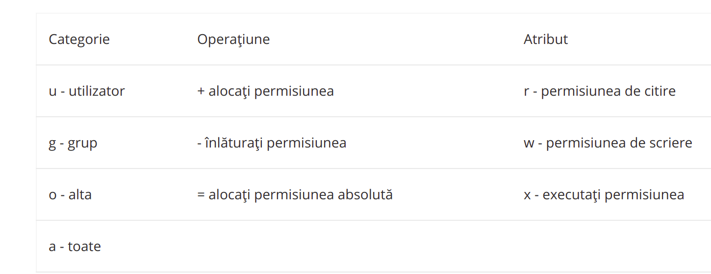
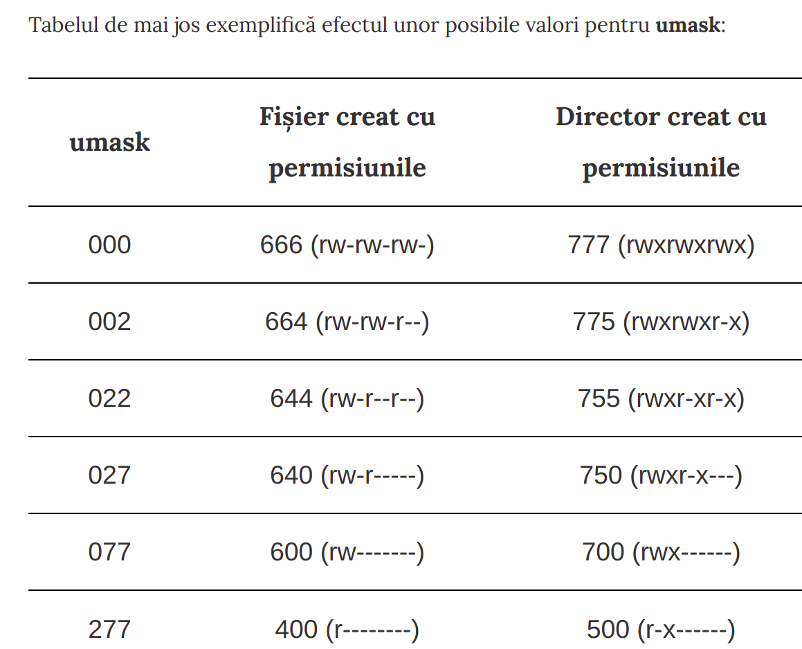
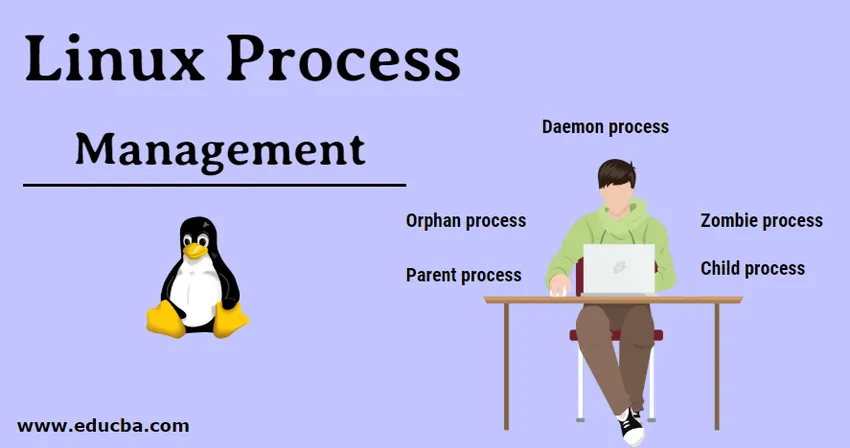
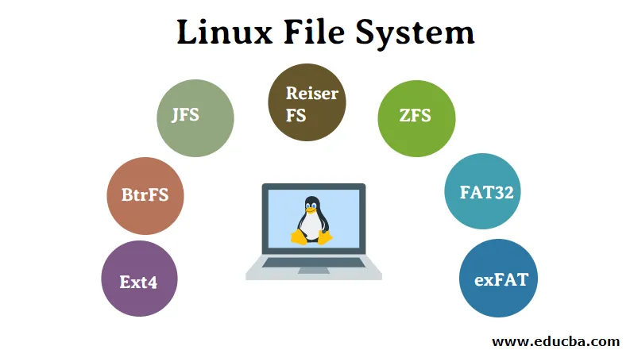

# Teorie Linux
Cuprins :
  - [Capitol 1 - Introducere Linux](#capitol-1---introducere-linux)
  - [Capitol 2 - Utilizatori și grupuri](#capitol-2---utilizatori-și-grupuri)
  - [Capitol 3 - Permisiuni fisiere](#capitol-3---permisiuni-fisiere)
  - [Capitol 4 - Procese](#capitol-4---procesele-linux)
  - [Capitol 5 - Pachete](#capitol-5---pachete)
  - [Capitol 6 - Sistem de fisiere](#capitol-6---sistem-de-fisiere)
  
  
## **Capitol 1 - Introducere Linux**
LINUX este denumit cel mai utilizat sistem de operare și este cel mai bine cunoscut pentru eficiența și performanța sa rapidă. LINUX a fost introdus pentru prima dată de Linux Torvalds și se bazează pe Linux Kernal. Poate rula pe diferite platforme hardware fabricate de HP, Intel, IBM etc.

* Diferența între LINUX și UNIX?
    * **LINUX** este un software open source și un sistem de operare gratuit utilizat pentru hardware și software pentru computer, dezvoltarea jocurilor, PC-uri etc.\
    **UNIX** este un sistem de operare care este practic utilizat în Intel, HP, servere de internet etc.
  * **LINUX** are prețuri, precum și versiuni distribuite și descărcate gratuit.	Diferite versiuni / arome de UNIX au structuri de preț diferite.
  * Utilizatorii **LINUX** ar putea fi oricine, inclusiv utilizatorii casnici, dezvoltatorii etc.	**UNIX** a fost dezvoltat practic pentru mainframe, servere și stații de lucru, cu excepția OSX, care este conceput astfel încât să poată fi folosit de oricine.
  * **LINUX** Sistemul de suport pentru fișiere include Ext2, Ext3, Ext4, Jfs, Xfs, Btrfs, FAT etc.	**UNIX** - sistemul de suport pentru fișiere include jfs, gpfs, hfs etc.
  * BASH (Bourne Again Shell) este shell-ul implicit **Linux**, adică interfața în modul text care acceptă mai mulți interpreți de comandă.	Pentru **UNIX** - Bourne shell servește ca interfață în modul text, care este acum compatibilă cu multe altele, inclusiv BASH.
  * **LINUX** oferă două interfețe grafice, KDE și Gnome.	Pentru **UNIX** fost creat un mediu desktop comun care servește ca GUI pentru UNIX.
  * Exemple **LINUX** : Red Hat, Fedora, Ubuntu, Debian etc.	Exemple **UNIX** : Solaris, All Linux
  *  **LINUX** oferă o securitate mai mare și are aproximativ 60-100 de viruși enumerați până în prezent.	**UNIX** de asemenea, este foarte securizat și are aproximativ 85-120 de viruși enumerați până în prezent.
### _Ce înțelegem de Linux Kernal? Este legal să îl editam?_
Răspuns: „Kernal” se referă practic la acea componentă de bază a sistemului de operare al computerului care oferă servicii de bază pentru celelalte părți, precum și interacționează cu comenzile utilizatorului. Când vine vorba de „Linux Kernal”, acesta este denumit software de sistem de nivel scăzut care oferă o interfață pentru interacțiunile la nivel de utilizator.

Linux Kernal este considerat software gratuit și open-source, care este capabil să gestioneze resursele hardware pentru utilizatori. Deoarece este eliberat sub licența publică generală (GPL), devine legal ca oricine să o editeze.
### _Explicați LILO?_
Răspuns: `LILO (Linux Loader)` este încărcătorul de boot pentru sistemul de operare Linux care îl încarcă în memoria principală, astfel încât să poată începe operațiunile sale. Bootloader aici este un mic program care gestionează un boot dual. LILO domiciliat în MBR ( Master Boot Record ). 

### _Ce este spațiul Swap?_
Răspuns: Spațiul **swap** este cantitatea de memorie fizică care este alocată pentru a fi utilizată de Linux pentru a păstra temporar unele programe care rulează simultan. Această condiție apare de obicei atunci când memoria RAM nu are suficientă memorie pentru a suporta toate programele care rulează simultan. Această gestionare a memoriei implică schimbarea memoriei către și de la stocarea fizică.

### _Explicați desktop-ul virtual?_
Răspuns: Când există mai multe ferestre disponibile pe desktopul curent și apare problema minimizării și maximizării ferestrelor sau a restaurării tuturor programelor actuale, „Virtual Desktop” servește ca alternativă. Ne permite să deschidem unul sau mai multe programe pe o ardezie curată.

### _Explicați termenul GUI?_
Răspuns: GUI reprezintă `interfața grafică pentru utilizator.` GUI este considerat cel mai atractiv și mai ușor de utilizat, deoarece constă în utilizarea de imagini și pictograme. Aceste imagini și pictograme sunt făcute clic și sunt manipulate de către utilizatori în scopul comunicării cu sistemul.

### _Explicați termenul CLI?_
Răspuns: CLI înseamnă `Command Line Interface`. Este o modalitate prin care oamenii interacționează cu computerele și este, de asemenea, cunoscută sub numele de interfață cu linia de comandă. Se bazează pe procesul de tranzacție de solicitare și răspuns textual în care utilizatorul tastează comenzi declarative pentru a instrui computerul să efectueze operațiuni.
### _Enumerati stările procesului in Linux_?
Un proces Linux poate fi în oricare dintre următoarele stări de proces:
* **Rularea**: Procesul este fie în execuție, fie gata de rulare.
* **Întreruptibil**: o stare blocată a unui proces și așteptarea unui eveniment sau semnal de la un alt proces.
* **Neîntreruptibil**: o stare blocată. Procesul așteaptă o stare hardware și nu poate gestiona niciun semnal.
* **Oprit**: procesul este oprit sau oprit și poate fi repornit de un alt proces.
* **Zombie**: procesul a fost încheiat, dar informațiile sunt încă în tabelul de proces.
### _Tipuri de permisiuni de fișiere sub LINUX?_
Răspuns: Fiecărui fișier și director din Linux li se atribuie trei tipuri de proprietari și anume „Utilizator”, „Grup” și „Altele”. Cele trei tipuri de permisiuni definite pentru toți cei trei proprietari sunt:
* `Citit`: Această permisiune vă permite să deschideți și să citiți fișierul, precum și să enumerați conținutul directorului.
* `Scrie`: Această permisiune vă permite să modificați conținutul fișierului, precum și să adăugați, să eliminați și să redenumiți fișierele stocate în directoare.
* `Executa`: Utilizatorii pot accesa și rula fișierul din director. Nu puteți rula un fișier decât dacă este setată permisiunea de executare.

### _Explicați Linux Shell?_
Răspuns: Pentru executarea oricăror comenzi, utilizatorul folosește un program cunoscut sub numele de `shell`. Linux shell este practic o interfață de utilizator utilizată pentru executarea comenzilor și comunicarea cu sistemul de operare Linux. Shell nu folosește nucleul pentru a executa anumite programe, a crea fișiere etc.
Există mai multe shell-uri disponibile cu Linux, care includ următoarele:
* BASH (Bourne Again SHell)
* CSH (Shell C)
* KSH (Korn Shell)
* TCSH

### _Ce este un script Shell?_
Răspuns: este un fișier de program sau se spune un fișier text plat în care anumite comenzi Linux sunt executate una după alta. Deși viteza de execuție este lentă, scriptul Shell este ușor de depanat și poate simplifica și procesele de automatizare de zi cu zi.

### _De ce Linux este considerat mai sigur decât alte sisteme de operare?_
Răspuns: Linux este un sistem de operare open-source și în zilele noastre crește rapid în lumea / piața tehnologică. Deși întregul cod scris în Linux poate fi citit de oricine, atunci este considerat mai sigur din următoarele motive:
* Linux oferă utilizatorilor săi privilegii implicite limitate, care sunt practic restrânse la nivelurile inferioare. în cazul oricărui atac de virus, acesta va ajunge doar la fișierele și folderele locale în care sunt salvate daunele la nivelul întregului sistem.
* Are un sistem puternic de audit care include jurnalele detaliate.
* Caracteristicile îmbunătățite ale tabelelor IP sunt utilizate pentru a implementa un nivel mai mare de securitate pentru mașina Linux.
* Linux are permisiuni de program mai stricte înainte de a instala ceva pe computer.

### _Explicati comanda cat_:
Cat are prescurtarea de la concatenate. Aceasta nu numai că afișează conținutul unui fișier, combina mai multe fișiere afișându-vă conținutul acestora dar chiar poate și sa creeze fisier nou.

## **Capitol 2 - Utilizatori și grupuri**

În orice sistem de operare tradițional, există utilizatori și grupuri. Acestea există doar pentru nivelul de acces și permisiuni.Fiecare utilizator are propriul lui director personal în folderul home, în care își stochează diverse fișiere. Sistemul folosește ID utilizator sau **(UID)** pentru a gestiona utilizatorii si ID-ul de grup **(GID)**.
### _Rolul Root_
În Linux, putem avea utilizatori și alții decât oamenii obișnuiți care utilizează sistemul. Uneori acești utilizatori sunt denumiți demoni de sistem, care rulează continuu procese pentru a menține integritatea sistemului de operare. Unul dintre cei mai importanți utilizatori este _root_ sau superutilizatorul. Utilizatorul **root** este cel mai puternic din acel sistem, iar acesta poate accesa orice fișier și mai ales poate porni și opri orice proces. Pentru acest motiv poate fi periculos să operam tot timpul pentru că s-ar putea să ștergem din greșeală anumite fișiere critice pentru sistem.
### _Comanda sudo_
Din fericire, dacă este nevoie de acces root și utilizatorul are acces la root sau privilegii administrative, pot rula comenzi ca și root, dintr-un utilizator normal, cu ajutorul comenzii sudo. Comanda `sudo` **(superuser do)** este folosita pentru a rula o comandă cu acces root. De ex : _sudo cat /etc/shadow_, va necesita parola pentru a avea acces la fisier.
### _Comanda su_
Mai putem rula comenzi ca root cu ajutorul comenzii `su`. Această comandă practic va “substitui utilizatorii” și va deschide un shell pentru root, dacă nici un utilizator nu este specificat. Putem folosi această comandă pentru a substitui orice utilizator, atât timp cât le știm parola.

### _Comanda visudo_
Acum că știm ce comenzi să rulam ca și super utilizator, întrebarea este cum știm cine are acces să facă acest lucru? Sistemul nu va lăsa pe oricine să ruleze comenzi ca root. Și totuși cum de știe care utilizator are dreptul? Exista un fișier denumit `/etc/sudoers`, iar acest fișier gestionează utilizatorii care au dreptul să ruleze comanda sudo. Putem edita acest fișier cu ajutorul comenzii `visudo`.

### _Fișierul /etc/passwd_ 
In mod normal într-o pagină de setări a utilizatorilor, ne așteptam să vedem numai utilizatori umani. Insă, vom remarca că fișierul /etc/passwd conține și alți utilizatori pentru a rula diferite procese cu permisiuni diferite. De exemplu, utilizatorul daemon este folosit pentru procese daemon.
`Fișierul /etc/passwd` - Pentru a afla ce ID îi corespunde unui utilizator, ne uităm în fișierul cat /etc/passwd. Fiecare linie afișează informație despre un singur utilizator, și de regulă, vom vedea utilizatorul root în prima line a acestui fișier : `root:x:0:0:root:/root:/bin/bash`  , unde sunt mai multe câmpuri separate prin simbolul : care ne oferă informații adiționale despre utilizatori. Acum, le explicăm pe rând:
  * 1.Utilizator
  * 2.Parola utilizatorului – parola nu este stocată în acest fișier, ci este stocată de regulă în fișierul /etc/shadow,  acesta conține parole de utilizator criptate. Aici, în acest câmp, vom vedea multe simboluri diferite. Dacă vom vedea un “x” asta înseamnă că parola este stocată în fișierul /etc/shadow, în timp ce un “*” se va traduce în faptul că utilizatorul nu are acces la logare (conectare), iar dacă acel câmp este gol, asta înseamnă că utilizatorul nu are o parolă.
  * 3.ID-ul utilizatorului – după cum vedem UID-ul lui root este 0
  * 4.ID-ul grupului
  * 5.Câmpul GECOS – Acesta este de regulă folosit pentru a lăsa comentarii despre utilizator sau despre cont, cum ar fi numele lor real sau numărul de telefon. Aceste date sunt separate prin virgulă.
  * 6.Directorul home al utilizatorului
  * 7.Shell-ul utilizatorului – vom vedea probabil o mulțime de utilizatori cu shell-ul implicit setat pentru bash.

 `Fișierul /etc/shadow`  este folosit pentru a stoca informații despre autentificarea utilizatorilor. Necesită permisiuni de citire de nivel super utilizatore (root).
_sudo cat /etc/shadow_  :
root:MyEPTEa$6Nonsense:15000:0:99999:7:::

`Fișierul /etc/group`  - permite grupruri diferite cu permisiuni diferite.
_cat /etc/group_    :   root : * : 0 : pete\
Foarte similar cu structura câmpurilor din /etc/password, cele din /etc/group sunt după cum urmează:
    * 1.Nume grup
    * 2.Parola grup – Nu există o nevoie de a seta o parolă pentru un grup, ci doar folosirea comenzii sudo pentru elevarea privilegiilor mai degrabă este standardul. Un simbol “*” va fi pus acolo ca și valoare implicită.
    * 3.ID Grup (GID)
    * 4.Lista de utilizatori – putem specifica manual utilizatorii pe care îi dorim să facă parte dintr-un anumit grup.
  
### _Gestionare utilizatori_
* `sudo useradd radu` - adaugarea utilizator nou prin crearea unui director home și altele, crează o intrare în fișierul /etc/passwd pentru utilizatorul radu, setează grupurile implicite și adaugă încă o intrare în fișierul /etc/shadow
* `sudo userdel radu` - anuleaza modificările făcute în fișiere de către comanda useradd. 
* `passwd radu` -permite să schimbam parola personala sau a unui alt utilizator (asta dacă avem privilegii root).

## **Capitol 3 - Permisiuni fisiere**

Daca aplicam `ls -l Desktop` rezulta `drwxr-xr-x 2 ana 4096 apr 25 11:45` . Permisiunile fișierelor sunt împărțite în patru părți sau grupuri. Prima parte este tipul de fișiere ,,d'' fiind director. Următoarele trei grupuri (părți) ale parametrilor fișierului reprezintă de fapt permisiunile în sine. Permisiunile sunt afișate în grupuri de 3 biți fiecare. 
  
Primii 3 biți reprezintă permisiunile **utilizatorului**, apoi permisiunile **grupului** și în final permisiunile pentru **alții**.
d | rwx | r-x | r-x 
    * r: citire
    * w: scriere
    * x: execuție (în principiu un program executabil)
    * -: gol (fără acea permisiune)

Schimbarea permisiunilor poate fi făcută foarte ușor cu ajutorul comenzii `chmod 755 fisierul_meu`.

Reprezentările numerice sunt prezentate mai jos:

4: permisiunile de citire

2: permisiunile de scriere

1: permisiunile de execuție

    7 = 4 + 2 + 1, deci 7 reprezintă permisiunile utilizatorului și conține drepturi de citire, scriere și execuție.\
    5 = 4 + 1, grupul are permisiuni de citire și execuție.\
    5 = 4 +1, și ceilalți utilizatori au drepturi de citire și execuție.

### _Permisiuni de proprietate_
În plus față de modificarea permisiunilor, deasemenea putem modifica și proprietatea (apartenența) asupra fișierului deținută de un utilizator și un grup.
* `sudo chown ana tv.txt`  -va seta ca proprietar al fișierul tv.txt pe utilizatorul ana.

* `sudo chgrp anawork tv.txt` -va seta ca proprietar al fișierul tv.txt pe grupul de utilizator denumit anawork.
* `sudo chown ana:anawork tv.txt`- le seteaza pe ambele, si user ana si grup anawork.

### _Comanda umask_ 
Fiecare fișier care este creat vine cu un set de permisiuni implicit. În mod implicit, pe sistemele Linux, _permisiunile de creare implicite sunt 666 pentru fișiere_, ceea ce oferă permisiunea de citire și scriere utilizatorului, grupului și altora și la _777 pentru directoare_. Linux nu permite crearea unui fișier cu permisiunile de execuție.

Permisiunile de creare implicite pot fi modificate folosind utilitarul de **umask**. Această comandă are la intrare o valoare octală care reprezintă biții care vor fi înlăturați din valoarea 777 pentru directoare, sau din permisiunile 666 pentru fișiere, în momentul în care un fișier nou este creat.

Pentru simplitate, trebuie reținut că umask este o simplă scădere din valoarea 777 sau 666; umask reprezintă înlăturarea unor biți.
Reprezentarea **octală** și **simbolică** a celor scrise în TABELUL de mai sus: 
* `octala` => 666 - 022 =644 (fisier)sau  777 - 022=755 (director).
* `simbolica` => rwxrw-rw- minus ----w--w- rezultă rwxr--r-- (sau 644 - pentru fișiere); rwxrwxrwx minus ----w-w- rezultă rwxr-xr-x (sau 755 - pentru directoare)

Cele mai multe distribuții Linux folosesc pentru umask valoarea 002 sau 022.
Pentru a afla ce valoare umask folosește distribuția noastră, vom da comanda simplă `umask`, fără niciun parametru. Valoarea umask este afișată cu 4 digiți (primul reprezintă valoarea octală pentru SUID, SGID sau bitul sticky): 0002. Pentru a schimba valoarea umask, vom folosi tot codul octal din 4 digiți => 0022. Iar dând comanda umask cu parametrul -S, va fi afișată valoarea simbolică a permisiunilor cu care se vor crea noile directoare:u=rwx,g=rwx,o=rx

### _Permisinea speciale_
* **1. SUID =setuid** (Set User ID) -rwsr-xr-x
  
Reprezinta o permisiune speciala pentru fisierele executabile.Ea îi spune sistemului Linux să ruleze programul respectiv cu permisiunile celui care deține fișierul (proprietarul), nu ale celui care îl execută.
De exemplu, dacă un fișier este deținut de superutilizator (root) și are setat bitul SUID, programul va rula cu privilegii de root și, prin urmare, poate accesa orice fișier de pe computer - acest aspect poate reprezenta o foarte gravă problemă de securitate!

* **2.SGID=setgid** (Set Group ID) -rwxr-sr-x   /  drwxr-Sr-x
  
Opțiunea SGID este similară lui SUID, dar este setată pentru poziția de execuție din setul de permisiuni pentru grup. Se notează cu s dacă fișierul sau directorul are drept de execuție pentru grup și cu S dacă fișierul sau directorul nu are drept de execuție pentru grup (în ultimul caz setarea acestui bit nu-și va face efectul):

* **3.Sticky bit** -drwxrwxrwt
Bitul sticky este folosit pentru a proteja de la ștergere fișierele unui director în care au acces mai mulți utilizatori (cum ar fi /tmp) de către cei care nu le dețin. Când acest bit este prezent la un director, fișierele din interiorul său pot fi șterse numai de proprietar (cel care le-a creat) sau de administrator (root). Bitul sticky este marcat cu ajutorul literei **t** pe poziția dreptului de execuție pentru alții (other):

Permisiunile SUID, SGID și sticky bit corespund următorilor biți(reprezentare numerica):

1 - permisiune sticky bit (sudo chmod +t directorul_meu $ sudo chmod 1755 directorul_meu)

2 - SGID (sudo chmod g+s fisierul_meu  $ sudo chmod 2555 fisierul_meu)

4  - SUID (sudo chmod u+s fisierul_meu $ sudo chmod 4755 fisierul_meu)

## **Capitol 4 - Procesele Linux**
Procesele sunt programele care rulează pe calculatorul nostru. Acestea sunt gestionate de kernel și fiecare proces are un ID asociat denumit ID de proces sau (PID) process ID. Acest PID este dat în ordinea în care procesele sunt create. Trebuie să lansăm comanda `ps` pentru a vedea lista cu procesele care rulează:
* PID: ID Proces
* TTY: Terminalul (controlor) asociat cu acel proces 
* STAT: Codul statusului de proces
* TIME: Timpul total de folosire al CPU
* CMD: Denumirea comenzii/fișierului executabil.

Comada ps poate deveni destul de greu de privit și analizat, deoarece de cele mai multe ori vom fi interesați doar de câmpurile legate de PID, STAT și COMMAND.

O altă comandă utilă este comanda `top`, care ne furnizează informații în timp real despre procesele care rulează pe sistem, în locul unui tabel static pe care ni-l oferă comanda `ps aux`. În mod implicit vom avea o reîmprospătare a parametrilor la fiecare 10 secunde. Comanda top este o unealtă extrem de utilă pentru vizualizarea proceselor și identificarea acelora care “irosesc” foarte multe resurse.

**TTY** este, de fapt, terminalul care a executat comanda.Există două tipuri de dispozitive terminale, terminale _obișnuite_ (Ctrl-Alt-F1 pentru a intra în TTY1 (prima consolă virtuală).) și _pseudoterminale_(terminalele folosite cu ajutorul ferestrei terminalului de shell și sunt notate cu PTS).
Cum determini totalul de memorie utilizat de LINUX? RASPUNS : verificand cu comenzile : `free` , `top`, `htop`, `vmstat`, 

**Process demon** -  ajuta sistemul sa ruleze, pornesc la initializarea sistemului si se termina cu acesta. La rularea comenzii _ps_, in coloana TTY unde apare _?_, rezulta ca nu exista terminal responsabil de respectivul process.

### _Gestionarea proceselor in Linux_

Se utilizeaza urmatoarele apeluri de sisteme:
1. __fork__ - in momentul in care un process este creat, se cloneaza sub forma unei  bifurcatii de apel de sistem, care creaza _procese copil_, iar procesul original devine _proces parinte_ si primeste un id tip PPID. (aflam mai multe cu ps- l). DEci fork intoarce PID-ul noului proces in procesul parinte si valorea 0 in procesul copil. Pentru afisarea PID-ului procesului curent , vom folosi **getpid**, iar al procesului parinte cu ajutorul **getppid**.
2. __exec__ - va executa un nou program inlocuind imaginea procesului curent cu cea dintr-un fisier executabil.
3. **wait**  - apel de sistem utilizat pentru a face procesul sa astepte. De regula, procesul parinte trebuie sa astepte terminarea procesului copil, pentru a analiza starea acestora si a transmise catre kernel.
4. **exit** - terminarea procesului - eliberarea resurselor. In momentul in care un proces este gata de terminare, kernel-ul este anuntat cu ajutorul statusului terminarii. Daca status=0, rezulta ca procesul a reusit.\
_Procesele orfan_ - apar in momentu in care procesul parinte se opreste(moare) inaintea procesului copil, iar kernel-ul stie ca nu va mai primi apelul de asteptare ,,wait", asa ca va transfera acele procese in orfani si vor fi trimite catre INIT.\
_Procese zombie_  - cand procesul copil se inchide iar procesul parinte nu a trimis apelul de asteptare , kernelul il transforma zombie. Adica ele nu pot fi oprite, cu toate ca sunt moarte si nu putem folosi semnale. Daca procesul parinte trimite apel de asteptare, procesul zombie va disparea => ,,proces de secerare".
5. **nice**  - prioritizarea proceselor. Cu comanda top observam coloana NI care reprezinta nivelul consumului de timp de procesor al aplicatiei sau niceness.

### _Semnalele_
-sunt notificari catre un proces, ca ceva s-a intamplat (mesaj de intrerupere la nivel de software). In momentul in care un semnal este generat de un eveniment, acesta este trimis catre un proces si va ramane in asteptare pana cand este trimis/livrat.

**Comanda KILL** -putem trimite semnale care termina procesele, (ex kill 12445)
* SIGHUP - inchidere trimisa unui process atunci cand terminalul care controleaza procesul a fost inchis.
* SIGINT - intrerupere semnal CTRL-C
* SIGTERM - termina procesul, cu curatenie inainte
* SIGKILL - termina procesul, fara curatenie inainte
* SIGSTOP - opreste/suspenda procesul.

**Starile procesului** :
* **R**unning - proces in executie/gata de rulare
* **I**nterruptible - se asteapta ca sa primeasca date
* **U**ninterruptible - proces care nu poate fi oprit (restart)
* **Z**ombie - procese care asteapta care starea lor sa fie receptionata
* **S**topped - proces oprit/suspendat.

## **Capitol 5 - Pachete**
### _Distribuția Software_
Sistemul este compus din mai multe pachete software, ca de exemplu navigatoare de internet, editoare de text, redare fișiere media, etc. Aceste pachete sunt gestionate prin managerele de pachete, care instalează și mențin software-ul pe sistem. 
Dar, ce sunt de fapt  **pachetele**? Sunt acele sub numele de Chrome, Photoshop, etc, dar ceea ce reprezintă de fapt este de fapt o multitudine de fișiere care au fost compilate în unul singur. 
Cele mai des folosite sunt: 
* (.deb) de la Debian -folosite în distribuții ca Debian, Ubuntu, LinuxMint, etc
* (.rpm) de la Red Hat  întâlnite în Red Hat Enterprise Linux, Fedora, CentOS, etc.
### _Biblioteci de pachete_
Acestea sunt o locație centrală de stocare pentru pachete. Distribuția Linux deja vine instalată cu surse pre-aprobate de unde poate instala pachete și tot de acolo instalează pachetele software pe care le regăsim în sistemul nostru. De exemplu, pe un sistem Debian fișierul cu sursele bibliotecilor software se găsește în `/etc/apt/sources.list`. Calculatorul va ști unde să caute și sa verifice orice bibliotecă software pe care am adăugat-o anterior.
### _tar și gzip_
Înainte de a vorbi despre instalarea pachetelor și despre diferite managere de pachete, avem nevoie să înțelegem arhivarea și comprimarea fișierelor.
Un fișier tip arhivă are denumirea extensiei _.rar_ sau _.zip_. Aceste fișiere sunt o arhivă de fișiere, care pot conține o multitudine de fișiere înăuntru, fiind extrem de utile în foarte multe cazuri.

* Comprimarea fișierelor cu ajutorul comenzii gzip si conțin extensia .gz. => `gzip fisierul_meu`\
Pentru decompresia unei fișier: `gunzip fisierul_meu.gz`

Din păcate, gzip nu poate adăuga fișiere multiple într-o singură arhivă pentru noi. Din fericire avem la dispoziție comanda **tar** care face acest lucru. 
* În momentul în care cream o arhivă folosind comanda tar, aceasta va genera un fișier cu extensia .tar\
`tar cvf fisierul_meu_tar.tar fisierul_meu1 fisierul_meu2`\
c – creează;\
v – comunica utilitarului să dea cât mai multe mesaje în așa fel încât să vedem ce face programul sub capotă;\
f – numele fișierului tar trebuie sa fie pus după această opțiune, dacă creați un fișier tar va trebui să-i dați și un nume.

* Dezarhivarea cu ajutorul comenzii tar : `tar xvf fisierul_meu.tar`\
x – extrage\
v – spune programului să jurnalizez amănunțit pentru a ceea eventuale erori\
f – fișierul pe care dorim să îl dezarhivăm.

De multe ori vom vedea un fișier tar care a fost comprimat de forma <arhivameacomprimata.tar.gz> . Tot ce avem nevoie este să refacem pașii în ordine inversă:
1. primul pas îndepărtam compresia cu ajutorul comenzii gunzip 
2. dezarhivam fișierul tar. 
3. Sau putem să folosim alternativ opțiunea z cu comanda tar, care specifica acestei comenzi sa folosească utilitarul gzip sau gunzip: crearea unui fișier tar comprimat: `tar czf fisierul_meu.tar.gz`  si decomprimare și dezarhivare: `tar xzf fisier.tar`

### _Dependințele pachetelor_
Pachetele, de foarte puține ori, funcționează de unele singure, ci sunt de cele mai multe ori însoțite de dependințe pentru a le ajuta să ruleze. Aceste dependințe vin deseori sub forma unor pachete sau a unor biblioteci software comune. Bibliotecile soft comune sunt secvente de cod pe care alte programe vor să le folosească și nu mai vor sa le rescrie încă o data doar pentru ele. 

### _rpm și dpkg_
La fel cum .exe este un fișier executabil, așa este și un fișier .deb sau .rpm. În mod normal nu am fi capabili să remarcam aceste fișiere dacă am folosi magazine software, dar dacă descărcam direct pachetele, le vom obține mai mult ca sigur în aceste formate populare. Evident, acestea sunt potrivite doar pentru distribuțiile lor, .deb pentru distribuțiile bazate pe Debian și rpm pentru cele bazate pe Red Hat. Pentru a instala direct aceste pachete, puteți folosi comenzile pentru managementul pachetelor: rpm and dpkg. Aceste unelte (utilitare) sunt folosite pentru a instala pachete de fișiere, totuși acestea nu vor instala dependințele pachetelor.
* Instalarea unui pachet:
    * Debian: dpkg -i un_oarecare_pachet.deb
    * RPM: rpm -i un_oarecare_pachet.rpm
Opțiunea i vine de la install. Deasemenea puteți să folosim forma lungă –install.

* Ștergerea unui pachet:
    * Debian: dpkg -r un_oarecare_pachet.deb
    * RPM: rpm -e un_oarecare_pachet.rpm
* Listarea pachetelor instalate: Debian: dpkg -l iar pentru RPM: rpm -qa

### _yum și apt_

* Instalarea unui pachet dintr-un depozit/ bibliotecă software:
    * Debian: $ apt install nume_pachet
    * RPM: $ yum install nume_pachet
* Ștergerea unui pachet / aplicație:
    * Debian: $ apt remove nume_pachet
    * RPM: $ yum erase nume_pachet
* Actualizarea pachetelor / aplicațiilor:
    * Debian: apt update; apt upgrade
    * RPM: yum update
* Obținerea de informații despre un pachet instalat:
    * Debian: apt show nume_pachet
    * RPM: yum info nume_pachet 

### _Compilarea codului sursă_
De cele mai multe ori vom întâlni un pachet oarecare care va veni doar sub forma unui cod sursă în stare pură. Vom avea nevoie să folosim câteva comenzi pentru compilarea acelui pachet sub formă de cod sursă și apoi să-l instalam pe sistem.
Vom avea nevoie de programele și aplicațiile care ne vor ajuta la compilarea codului sursă : `sudo apt install build-essential`

Imediat dupa asta, extragem (dezarhivm) conținutul fișierului pachet, care va fi, cel mai probabil sub forma unui fișier .tar.gz => `tar -xzvf pachet.tar.gz`
Înainte de a face orice altceva, citim cu atenție fișierele README sau INSTALL aflate în interiorul pachetului. Uneori vor fi instrucțiuni de instalare specifice acelui pachet, pe lângă comenzile generice prezentate mai jos.

În interiorul pachetului de instalare va fi un script de configurare, care va verifica de ce dependințe este nevoie să fie instalate pe sistemul nostru., și dacă mai lipsește ceva, veom vedea afișată o eroare în care ne va spune să rezolvam acele dependințe lipsă.\
Folosim **./configure**  (simbolurile ./ permit executarea acelui script în directorul curent).

**make**

În interiorul pachetului, va fi și un fișier denumit Makefile care conține regulile pentru compilarea aplicației. În momentul în care rulam comanda, acest fișier este verificat pentru a se respecta toate regulile introduse aici.

`sudo make install` = instalează fișierele pachetului, copiindu-le pe cele care trebuie în locațiile corecte ale calculatorului nostru.
`sudo make uninstall` = dezinstaleaza.

ATENTIE când folosim comanda make install. Dacă dorim să ștergem acest pachet, s-ar putea să nu ștergem tot pentru că nici nu știm că a fost adăugat pe sistemul nostru. E recomandat sa folosim comanda **checkinstall**. Această comandă va genera un fișier .deb pentru noi pe care îl putem instala și dezinstala cu ușurință.
`sudo checkinstall`

## **Capitol 6 - Sistem de fisiere**
_Sistemul de fișiere_ poate fi definit ca modul de stocare a datelor într-o anumită manieră, astfel încât acestea să poată fi localizate fără probleme, atunci când este necesar. Pe baza sistemului de operare, depinde de ce tip de sistem de fișiere a fost urmat.Sistemul de fișiere se ocupă de fișierele și directoarele care se presupune că sunt păstrate în dispozitivul de stocare folosind orice sistem de operare. Sistemul de operare joacă doar rolul unui intermediar care facilitează transferul de date către dispozitivul de stocare, astfel încât acesta să poată fi stocat acolo.

Daca tastam în terminal comanda ls -l / pentru a vedea directoarele afișate sub directorul rădăcină, ar trebui să arate după cum urmează:
* / – Directorul rădăcină a întregii ierarhii a sistemului de fișiere. Totul se află în interiorul acestui director.
* /bin – Programe (fișiere binare) esențiale gata să fie rulate; include comenzile de bază ale sistemului cum ar fi ls sau cp.
* /boot – Conține fișierele necesare încărcării kernelului.
* /dev – Fișiere de dispozitiv.
* /etc – Directorul configurației de bază a sistemului. Ar trebui să conțină numai fișiere de configurare și nici un fișier binar.
* /home – Director personal pentru utilizatori. Aici sunt stocate documentele, fișierele și setările personale.
* /lib – Conține biblioteci de fișiere care sunt folosite (apelate) de fișierele binare.
* /media – Folosit ca punct de montare (atașare) pentru dispozitivele media cum ar fi memoriile USB, etc.
* /mnt – Sisteme de fișiere montate temporar.
* /opt – Pachete opționale ale aplicațiilor software.
* /proc – Informații despre procesele care rulează în acel moment.
* /root – Directorul utilizatorului root.
* /run – Informații despre sistemul care rulează în acel moment, de la ultima restartare.
* /sbin – Conține fișiere binare esențiale funcționării sistemului, de regulă pot fi rulate doar de utilizatorul root.
* /srv – Date specifice care sunt servite (oferite) de către sistem.
* /tmp – Director de stocare pentru fișierele temporare.
* /usr – Acest director este oarecum denumit în mod nefericit. De cele mai multe ori nu conține fișiere ale utilizatorilor ca cele pe care le regăsim în directorul home. Acesta este menit pentru programele și utilitarele instalate de către utilizator, însă asta nu ne împiedică să adaugam directoare personale înăuntrul acestuia. Aici mai regăsim și subdirectoare ca /usr/bin, /usr/local, etc.
* /var – Directorul cu variabile este folosit pentru jurnalizarea (fișierele jurnal ale) sistemului, a utilizatorilor, cache, etc. În principiu cam tot ce este predispus să se schimbe continuu.

### _Top 7 sistem de fișiere Linux din septembrie 2019_ :

1. **Ext4**
   
Acesta este cel mai obișnuit pentru sistemele de fișiere Linux. Este compatibil cu versiunile mai vechi ext2 sau ext3. Suportă discuri de mărime de până la un exabyte și fișiere de până la 16 terabytes și mai multe caracteristici. Este alegerea standard pentru sistemele de fișiere Linux.

2. **BtrFS**
   
În termeni obișnuiți, a fost numit Butter FS. Fiind dezvoltat de oracle, acesta este unul dintre cele mai eficiente sisteme de fișiere capabile să proceseze volumul mare de date, copii de rezervă incrementale, creșteri de performanță și altele. În timpul instalării, trebuie să ne asiguram că am ales acest lucru, deoarece nu este sistemul de fișiere implicit în Linux. 

3. **JFS**
   
Acest sistem de fișiere este popular datorită simplității și capacității sale de a funcționa în funcție de dimensiunea hard disk-ului, dezvoltat de IDM. Funcționează bine cu ambele tipuri de hard disk-uri: stocare mică și mare, utilizează foarte puțină putere de procesare a procesorului și, datorită acestei caracteristici, este preferat de unii dintre administratorii sistemului.

4. **ReiserFS**
   
ReiserFS este unul dintre sistemele de fișiere din Linux, care a fost înlocuit de Reiser4 din cauza ineficienței sale. Este recomandat să alegeți Butter FS pe ReiserFS atunci când vine vorba de stocarea sau păstrarea datelor pe termen lung. Oricare dintre administratorii de sistem abia îl folosește, deoarece necesită ceva mai eficient pentru a lucra cu datele și hard disk-urile.

5. **ZFS**
   
cel mai avansat tip de sistem de fișiere care are multe caracteristici speciale, ne permite striping-ul și discurile de disc dinamice care sunt foarte utile în timpul lucrului cu dispozitivul de stocare a datelor. Este dezvoltat de microsistemul solar și organizația este responsabilă pentru toate actualizările și actualizările din acest sistem de fișiere.

6. **FAT32**
   
oferă cea mai bună modalitate de a stoca fișierele, astfel încât sistemul de operare să poată găsi ușor de gestionat acele fișiere și directoare. Este important să înțelegem că, deși este cel mai obișnuit, utilizatorul trebuie să aleagă ce sistem de fișiere li se potrivește cel mai bine înainte de a alege unul pentru sistemul lor de operare.

7. **exFAT**
   
Este un alt sistem de fișiere care aparține familiei FAT, considerat sistemul de fișiere utilizat în mod frecvent atunci când vine vorba de lucrul cu datele sau fișierele. Toate sistemele de operare pot utiliza acest sistem de fișiere pentru a eficientiza funcționarea. Acest sistem de fișiere este bun atunci când vine vorba de a lucra cu date cu volum redus sau mare.

### _Anatomia unui disc_
SSD sau Hard discurile (discurile fixe) pot fi împărțite în partiții, în principiu făcând astfel mai dispozitive tip bloc.
Partițiile sunt extrem de folositoare pentru separarea datelor, putem crea cu foarte mare ușurință o partiție în loc să formatam întregul disc un singur tip de sistem de fișiere.

Fiecare disc va avea un tabel de partiționare (partition table)care stochează sectoarele discului alocate unei anumit partiții. Există două principale scheme de tabel folosite, și anume Master Boot Record (MBR) și GUID Partition Table (GPT).
* **MBR** 
  * tabel de partiționare tradițional 
  * Poate avea partiții primare, extinse și logice
  * are o limită de patru partiții primare
  * Partițiile adiționale pot fi create prin transformarea unei partiții primare într-o partiție extinsă, apoi în partiția extinsă se pot adăuga partiții logice. 
  * Suportă discuri de până la 2 terabytes
* **GPT**
    * noul standard pentru pentru partiționarea discurilor
    * Are un singur tip de partiție și putem crea o multitudine
    * Fiecare partiție are un ID unic global (globally unique ID (GUID))
    * Folosit de regulă împreună cu bootarea bazată pe UEFI 

Structura sistemului de fișiere este alcătuit dintr-o bază de date pentru gestionarea fișierelor:
* `Bloc de boot` – Este localizat în primele sectoare alocate sistemului de fișiere, conține informații folosite pentru a încărcarea sistemului de operare. 
* `Super bloc`– Acesta este un singur bloc care este situat imediat după blocul de boot și conține informații despre sistemul de fișiere, cum ar fi tabelul inode, mărimea blocurilor logice și mărimea sistemului de fișiere.
* `Tabel Inode` – ca o bază de date care gestionează fișierele. Fiecare fișier sau director are o intrare unică (ID) în tabelul inode și conține diverse informații despre fișier.
* `Blocuri de date` – Acestea sunt practic datele pentru fișiere și directoare.

`sudo parted -l`  - putem vizualiza partitia tip MBR sau GPT.

### _Partiționarea discului_
Există mai multe utilitare disponibile pentru acest lucru:
* fdisk – în principal o unealtă de partiționare în linie de comandă, nu are suport GPT
* parted – este o unealtă în linie de comandă, care are suport pentru tipurile de partiționare MBR și GPT
* gparted – este versiunea cu interfață grafică (GUI) a parted
* gdisk – fdisk, dar nu are suport MBR, numai suport GPT

        Exercițiu : Partiționați un dispozitiv USB jumătate cu o partiție ext4 iar cealaltă jumătate să rămână spațiu liber.

### _Crearea sistemelor de fișiere_
`sudo mkfs -t ext4 /dev/sdb2`

 Utilitarul (comanda) **mkfs** (make filesystem) ne permite să specificam tipul sistemului de fișiere pe care îl dorim și unde dorim să fie creat. Vom dori să cream un sistem de fișiere pe un disc partiționat recent sau pe un dispozitiv mai vechi pe care dorim să îl repartiționam. Mai mult ca sigur ne vom distruge sistemul de fișiere dacă încercam să cream un altul peste cel existent. Așa că mare atenție!

    Exercițiu : Creați un sistem de fișiere ext4 pe dispozitivul usb.

### _Comenzile mount și umount_
Înainte de a vizualiza conținutul sistemului de fișiere, va trebui să-l ”montam”. Pentru a face asta vom avea nevoie de locația dispozitivului, tipul de sistem de fișiere și de punctul de montare. Un punct de montare este un director din cadrul sistemului de fișiere unde va fi atașat noul sistem de fișiere pe care dorim să-l montăm. Practic vom monta dispozitivul într-un punct de montare.

Primul pas va fi să creăm punctul de montare, în cazul nostru **mkdir /dispozitivul_meu** :  `sudo mount -t ext4 /dev/sdb2 /dispozitivul_meu`
Opțiunea ,,-t" specifică tipul sistemului de fișiere, apoi locația dispozitivului, respectiv /dev/sda2, iar ultimul argument al comenzii îl reprezintă punctul de montare, adică /dispozitivul meu.

Pentru a ”demonta” un dispozitiv din punctul în care este montat, tastăm următoarea comandă: `sudo umount /dispozitivul_meu` sau `sudo umount /dev/sdb2`.

Fișierul /etc/fstab

În momentul în care dorim să montăm automat sisteme de fișiere la pornirea sistemului le putem adăuga într-un fișier denumit /etc/fstab (pronunța ”ef es tab” și nu ”ef stab”) o prescurtare pentru file system table (tabel al sistemului de fișiere). Acest fișier conține o listă permanentă a sistemelor de fișiere montate: `cat /etc/fstab`.

### _Partiția swap_
**swap-ul** este folosit pentru alocarea de memorie virtuală sistemului gazdă. Dacă avem puțină memorie, sistemul utilizează această partiție pentru a ”transfera” părți de memorie a proceselor în așteptare pe disc. 

Să spunem că dorim să setăm partiția /dev/sdb2 să fie folosită ca spațiu swap:
1. Mai întâi ne asiguram că nu avem nimic pe acea partiție
2. Rulam comanda: mkswap /dev/sdb2 pentru inițializare swap
3. Rulam comanda: swapon /dev/sdb2 pentru activare spațiu
4. Dacă dorim ca partiția swap să fie persistentă la restartare, veți avea nevoie să adăugați o intrare în cadrul fișierului /etc/fstab. 
5. Pentru a șterge swap: swapoff /dev/sdb2

### _Utilizarea discului_
Pentru a vedea gradul de ocupare (folosire) al discurilor noastre : `df -h` . Opțiunea -h ne afișează datele într-un format prietenos oamenilor. Putem vedea despre ce dispozitiv e vorba, cât spațiu a mai rămas nefolosit și cât a fost folosit.
`du -h` - ce fișiere și directoare ocupă cel mai mult spațiu. Pentru aceasta putem folosi comanda du.

### _Depanarea sistemului de fișiere_
Uneori sistemul nostru de fișiere nu este în cea mai bună stare, de cele mai multe ori cauzată de o închidere bruscă, ceea ce duce la date corupte pe respectivul disc. Depinde de sistemul de operare dacă va încerca să se autodepaneze (deși cu siguranță o putem face noi înșine).

Comanda **fsck** (filesystem check) este folosită pentru verificarea integrității unui sistem de fișiere și unde este posibil chiar pentru autodepanare. De regulă, în momentul inițializării discului de stocare a unui sistem de calcul, comanda fsck va fi rulată înainte de a monta discul pentru a se asigura că totul este în regulă. Totuși uneori, discul este atât de avariat încât va trebui să facem asta manual. Însă, ne asiguram că facem acest lucru folosind un alt disc de salvare, diferit de cel care trebuie depanat, sau undeva unde putem accesa sistemul de fișiere (partiția) fără a fi montată.
`sudo fsck /dev/sda`

### _Inoduri_
Sistemul de fișiere este alcatuit din toate fișierele efective, dar și o bază de date care le gestionează eficient. Această bază de date este cunoscută sub denumirea de tabel inode.
Un _inode_ (index node) este o înregistrare într-un tabel și există câte una pentru fiecare fișier. Aceasta descrie totul despre fișier, cum ar fi:
- Tipul de fișier – fișier normal, director, dispozitiv tip caracter.
- Proprietarul
- Grupul
- Permisiuni de acces
- Amprenta orară – mtime (ora și data ultimei modificări), ctime (ora și data ultimei schimbări de atribute), atime (ora și data ultimei modificări)
- Numărul de legături fizice (hardlinks) către fișier
- Mărimea fișierului
- Numărul de blocuri alocat pentru fișier
- Pointerii către blocurile de date ale fișierului – cel mai important!
- Practic inodurile stochează totul despre fișier, cu excepția numelui fișierului și a fișierului în sine!

_Când sunt create indourile?_

În momentul în care un sistem de fișiere este creat, se alocă și spațiu pentru inoduri deasemenea. Există mai multe tipuri de algoritmi care se execută pentru a determina cu exactitate de cât spațiu pentru inoduri este nevoie, în funcție de volumul discului și nu numai. Pentu a vedea câte inoduri sunt disponibile pe sistemul dvs. folosiți comanda `df -i`.

Inodurile sunt identificate numeric. În momentul în care un fișier este creat, acestuia i se atribuie un număr inode, în ordine crescătoare. Pentru a vizualiza numărul de inoduri, rulam comanda `ls -li` : primul câmp al acestei comenzi listează numărul inode.
Pentru informații detaliate despre un fișier o facem cu ajutorul comenzii stat: `stat ~/Desktop/`

_Cum localizează inodurile fișierele?_

Noi știm sigur că datele nostre sunt undeva pe disk, dar, din păcate nu au fost stocat secvențial. Așa că va trebui să folosim inodurile. Acestea indică sistemului calea către blocurile de date efective ale fișierelor. Într-un sistem de fișiere obișnuit (nu toate funcționează la fel), fiecare inode conține 15 pointeri, iar primii 12 dintre aceștia indică direct către blocurile de date. Cel de-al 13 – lea pointer, face trimitere către un bloc care conține pointeri către alte blocuri. Cel de-al 14-lea se comportă în mod asemănător celui de-al 13-lea. Cel de-al 15-lea la fel. Motivul pentru care sunt structurate astfel este pentru menținerea structurii identice pentru fiecare inode și să fie capabil să găsească fișiere de diferite mărimi. 