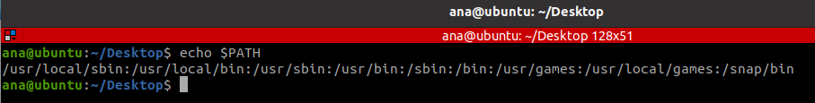
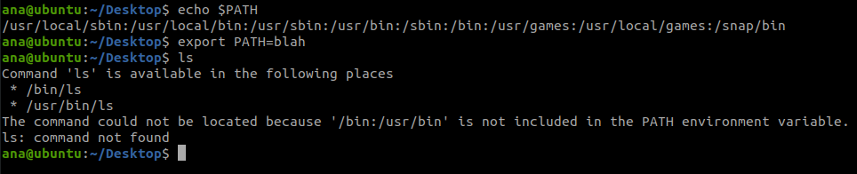

Cuprins :
- [Capitol 1 - Ce sunt variabilele de mediu?](#capitol-1---ce-sunt-variabilele-de-mediu)
- [Capitol 2 - Pentru ce este folosita variabila de mediu PATH? Cum se poate adauga o cale noua in ea?](#capitol-2---pentru-ce-este-folosita-variabila-de-mediu-path-cum-se-poate-adauga-o-cale-noua-in-ea)
- [Capitol 3 - Facilităţi de programare în Shell](#capitol-3---facilităţi-de-programare-în-shell)

## Capitol 1 - Ce sunt variabilele de mediu?

Shell-ul este un program special care furnizeaza o interfata intre nucleu sistemului de operare Unix (kernel) si utilizator. Din aceasta perspectiva, un shell poate fi privit ca:
- `limbaj de comanda` - In momentul in care un utilizator isi deschide o sesiune de lucru, un shell se instaleaza ca interpretor de comenzi.
- `limbaj de programare`, ce are ca element de baza comanda Unix si dispune de conceptele de variabila, constanta, expresie, structuri de control si subprogram.

**Variabilele de mediu** sunt variabilele ce sunt folosite de mediul nostru special pentru utilizatori. În cele mai multe cazuri, acesta va fi shell-ul BASH si sunt gestionate de consolă. Ele sunt moştenite de oricare program pe care îl pornim, inclusiv o altă consolă. O copie a acestor variabile este furnizată noilor procese, pe care o pot citi, modifica şi transmite proceselor pe care ele le generează (procese-copil). Fiecare utilizator, inclusiv root, are un set de variabile, ce sunt setate la valorile din modul implicit, asta dacă nu sunt schimbate. Variabilele de mediu global ale sistemului sunt stocate în /etc/environment. 

Exista două tipuri de variabile: 
1. locale – care există doar în instanta curentă a shell-ului si se noteaza cu litere mici
2. de mediu - folosite de sistem pentru a defini modul de functionare a programelor.

Comenzi:

    • env – afisează toate variabilele de mediu setate 
    • printenv - listeaza toate variabilele de mediu,
    • echo $ variabila- imprima valoarea unei anumite variabile,
    • export varname -  schimba/seteaza o variabila de mediu

Variabile importante predefinite :

    • $HOME – directorul în care se tin datele utilizatorului curent 
    • $PATH – listă cu directoare în care se caută executabilele 
    • $SHELL – programul de shell folosit implicit 
    • $HOSTNAME -numele masinii pe care suntem logati
    • $EDITOR – programul de editare fisiere implicit 
    • $TERM – tipul de terminal
    • $LANG – limba implicită (ex. ro_RO.UTF-8) 

**Variabila de mediu PS1**

PS1 - şirul folosit, ca prompt. Tradiţional (Bourne shell) utilizatorii obişnuiţi vor avea promptul $, iar superutilizatorul are promptul #. Ca şi celelalte variabile de mediu, PS1 poate fi redefinit de utilizator, majoritatea inter pretoarelor permiţând şi câteva facilităţi suplimentare. 

Multe alte variabile nu sunt doar predefinite, ci şi preconfigurate, prin fişierele de configurare. Fişierele de configurare ale consolei se afla in /etc/bashrc 
      
Pentru a crea o variabilă, trebuie doar să furnizam un nume și o valoare pentru aceasta. Numele variabilelor trebuie să fie descriptive și să ne amintească de valoarea pe care o dețin. Un nume de variabilă nu poate începe cu un număr și nici nu poate conține spații. 

Dacă un utilizator foloseşte mai frecvent programe din alte directoare, el poate schimba comportamentul variabilei de mediu, pentru ca aceasta să caute în directorul personal la sfârşit:
`export PATH=/usr/local/sbin:/usr/local/bin:/usr/sbin:/usr/bin:/sbin:/bin:/usr/games:/usr/local/games:/snap/bin:/home/ana/work`

Trebuie să retinem că atunci când folosim comanda export într-o consolă, schimbările sunt temporare, ele fiind valide doar pentru sesiunea curentă. Deschiderea unei noi sesiuni, chiar în cazul în care sesiunea curentă este în desfăşurare, va păstra comportamentul iniţial al variabilei de mediu.
Cum putem face ca aceste schimbări să devină permanente? =>prin adăugarea liniilor în cauză la fişierele de configurare ale consolei.

Calea pe care trebuie să o urmam în structura de fişiere pentru a ajunge la un anumit fişier, poate fi :

    • ABSOLUTA – porneste de la directorul rădăcină – root
    • RELATIVA  - nu porneste de la directorul rădăcină – root, de aceea vom folosi întotdeauna caracterele (.) şi (..) pentru directorul curent şi directorul superior. 

## Capitol 2 - Pentru ce este folosita variabila de mediu PATH? Cum se poate adauga o cale noua in ea?
Atunci când dorim ca sistemul să execute o comandă, nu trebuie să dam adresa ei completă pentru executarea acelei comenzi. 

De exemplu, ştim despre comanda `ls `că se află în directorul `/bin` (verificam cu ,,which -a ls” ), totuşi nu trebuie să folosim această comandă în formatul /bin/ls pentru a lista conţinutul directorului curent. Variabila de mediu **PATH** se ocupă de aceste situaţii. Această variabilă listează acele directoare din sistem în care se găsesc fişiere executabile, pentru ca utilizatorii să nu fie obligaţi să memoreze adresele comenzilor sau să tasteze foarte multe caractere. Astfel, PATH conţine multe directoare care au în numele lor bin , după cum ne arată imaginea de mai jos. Comanda echo este folosită pentru afişarea conţinutului („$”) variabilei PATH :

Aceastra controlează unde să se uite shell-ul după comenzile pe care le dăm, comenzi precum cd, ls, echo etc. Dacă nu găsește comanda în unul dintre directoarele de pe adresa noastră, ne va arăta eroarea “command not found,” chiar dacă aceasta există într-un alt director ce nu este în adresa noastră.

Info:

    • O cale foarte simplă prin care putem căuta fişiere excutabile este comanda which, prin care putem căuta în directoarele listate în variabila PATH a utilizatorului respectiv după executabilul dorit. Trebuie să ştim că, deoarece variabila listează numai traseele directoarelor care conţin fişiere executabile, which nu ne spune nimic despre fişierele obişnuite. Comanda which este folositoare atunci când ne confruntam cu probleme de genul „command not found”.

În exemplul de mai jos, utilizatoarea Tina nu poate folosi programul *acroread*, în timp ce colegul ei nu are nici o problemă pe acelaşi sistem. Colegul Tinei îi spune acesteia că programul există în /opt/acroread/bin , dar directorul nu este listat în variabila ei PATH. 

`tina:~>which acroread`

`usrbin/which: no acreread in (bin:/usr/bin:/usr/bin/X11)`

Problema poate fi rezolvată prin tastarea comenzii  ca traseu complet sau prin re-exportarea conţinutului variabilei PATH : `tina:~>export PATH=$PATH:/opt/acroread/bin`

Antrenament caz practic:
- **Exercitiu 1** : Export o cale inexistentă, de exemplu export PATH=blah şi încerc să listez conţinutul  directorului.

- **Exercitiu 2** Care este traseul directorului meu personal? Cum poate un alt utilizator să ajungă la directorul meu personal folosind un traseu relativ (exemplu utilazatoroul este un folder-ul lui personal /home/Dan)?
  
/home/ana/Desktop

cd ../ana/Desktop

- **Exercitiu 3** Realizaţi un script care poate afişa ceva de genul unei linii „hello, world”. Acordaţi-i permisiunile necesare pentru a-l rula. Testaţi acest script
  

Realizaţi un director numit script în directorul dumneavoastră personal şi mutaţi acest script în el. 

Adăugaţi directorul creat la traseul de căutare al sistemului, în mod permanent. Testaţi dacă scriptul poate fi executat fără a-i da traseul complet al locului în care se află.

Această linie dă instrucţiuni consolei să caute nu doar în variabila curentă, $PATH , ci şi în directorul /home/ana/Desktop/script.

- **Exercitiu 4** Ce alte informaţii solicită programele, în afară de cele conţinute de directoarele variabilei path şi home?
  
Multe programe au nevoie să cunoască ce fel de terminal folosim, această informaţie este stocată în variabila TERM . Multe programe vor să cunoască care este editorul favorit, în cazul în care trebuie să pornească un editor solicitat de un anume subproces. Consola pe care o folosiţi este stocată în variabila SHELL , tipul sistemului de operare în OS , şi aşa mai departe.

## Capitol 3 - Facilităţi de programare în Shell

Pe lângă execuţia comenzilor citite de la un terminal, shell-ul poate controla şi execuţia unor comenzi citite dintr-un fişier. Astfel de fişiere se numesc proceduri shell (“shell scripts”) şi, pe lângă comenzi Linux propriu-zise, pot conţine structuri pentru controlul fluxului şi pot fi prevăzute cu argumente preluate din linia de comandă prin care ele se lansează în execuţie. 

Marcarea începutului unui comentariu se face folosind caracterul # (diez), toate caracterele care apar după acesta fiind ignorate de către shell-ul implicit. Face excepţie situaţia în care al doilea caracter este !, caz în care shell-ul interpretează restul liniei ca şi o comandă shell pe care o execută. Din această cauză, majoritatea scripturilor shell încep cu un comentariu special de forma:

#!/bin/bash
Acest comentariu indică interpretorului de comenzi implicit faptul că se doreşte ca scriptul să fie interpretat folosindu-se interpretorul /bin/bash, pe care il şi lansează în execuţie spre a interpreta restul scriptului. După caz, se poate specifica orice shell dorit.

O comandă Linux are forma:
	$ comanda arg1 arg2 ... argn
Dacă comanda este numele unui fişier de comenzi (script) interpretat de către shell-ul implicit, atunci numele comenzii şi primele 9 (nouă) argumente, pot fi utilizate în mod direct în interiorul scriptului ca parametri formali. Asocierea argumentelor din linia de comandă cu parametrii dintr-un script shell este:

$ comanda arg1 arg2 ...  arg9 arg10 ... argn
	   
     $0   $1   $2  ...  $9

Pentru a putea lansa un fisier numefis (in loc de comanda) este necesar ca < nume fisier> să fie făcut fişier executabil. Aceasta înseamnă că după crearea sa, printr-un editor de texte trebuie setat dreptul de executie, prin comanda:`chmod a+x <numefisier>`